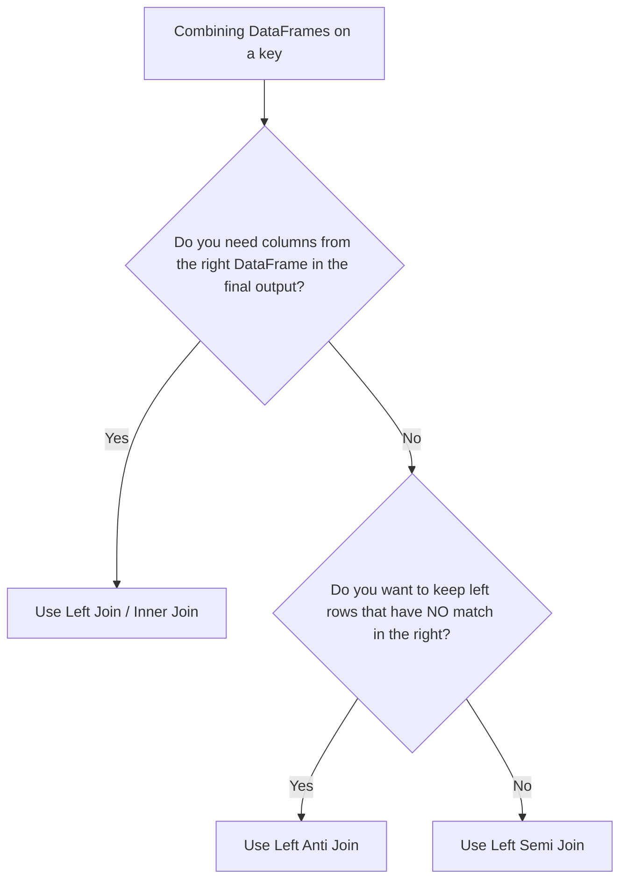

# 2.1.3 What is a Left Anti Join and how does it differ from a Left Join

A Left Anti Join returns only the rows from the left DataFrame that have no match in the right DataFrame, acting as a highly optimized "NOT EXISTS" filter. It differs from a Left Join by completely ignoring right-side columns and preventing row explosion caused by duplicate keys in the right DataFrame.

### 0. Setup

```python
from pyspark.sql import SparkSession

spark = SparkSession.builder.getOrCreate()

# Left DataFrame: All employees
all_employees = spark.createDataFrame([
    (1, "Alice", "Engineering"),
    (2, "Bob", "Sales"),
    (3, "Charlie", "HR"),
    (4, "David", "Engineering")
], ["id", "name", "dept"])

# Right DataFrame: Promoted employees (Note: Alice has duplicate records)
promoted_employees = spark.createDataFrame([
    (1, "Senior Engineer"),
    (2, "Sales Lead"),
    (1, "Staff Engineer") 
], ["id", "new_title"])
```

### 1. Core Concept & Decision Tree (CRITICAL)

Use this decision tree to figure out exactly which join semantics you actually need before writing code.



### 2. Syntax & Implementation

```python
from pyspark.sql.functions import col

# 1. LEFT JOIN: Keeps all left rows, appends right columns. 
# Non-matches get nulls. Matches duplicate if right keys are not unique.
left_join_df = all_employees.join(
    promoted_employees, 
    on="id", 
    how="left"
)

# 2. LEFT ANTI JOIN: Keeps only left rows that DO NOT exist in the right.
# Drops all right columns immediately.
left_anti_df = all_employees.join(
    promoted_employees, 
    on="id", 
    how="left_anti"
)

# Show the results
left_join_df.show()
left_anti_df.show()
```

### 3. Exact Output

```python
# Output for left_join_df.show():
# Notice Alice is duplicated because she has two records in the right DataFrame.
# Charlie and David get nulls for new_title.
# +---+-------+-----------+---------------+
# | id|   name|       dept|      new_title|
# +---+-------+-----------+---------------+
# |  1|  Alice|Engineering|Senior Engineer|
# |  1|  Alice|Engineering| Staff Engineer|
# |  2|    Bob|      Sales|     Sales Lead|
# |  3|Charlie|         HR|           null|
# |  4|  David|Engineering|           null|
# +---+-------+-----------+---------------+

# Output for left_anti_df.show():
# Notice Alice and Bob are completely gone. 
# Only Charlie and David remain (they weren't promoted).
# No right columns are included.
# +---+-------+-----------+
# | id|   name|       dept|
# +---+-------+-----------+
# |  3|Charlie|         HR|
# |  4|  David|Engineering|
# +---+-------+-----------+
```

### 4. Interview Pro-Tips / Gotchas

*   **The Row Explosion Trap:** This is the #1 interview trap. In a Left Join, if the right DataFrame has duplicate keys (like Alice having two promotions), the left row duplicates (Cartesian product for that key). A Left Anti Join only checks for *existence*. Even if the right key appears 100 times, the left row is returned exactly once. Always use Anti Join for "NOT IN" logic to prevent massive, silent data duplication.
*   **Under the Hood (First Principles):** Never do `left_join.filter(col("right_col").isNull())`. That forces Spark to materialize the entire Left Join (shuffling all right columns across the network) before filtering them out. A native `left_anti` join tells the Catalyst optimizer to drop the right payload immediately during the shuffle phase, saving massive network I/O and memory. 
*   **Pandas vs. Spark:** In Pandas, you'd do a left merge with `indicator=True` and filter for `left_only`, which is a clunky memory hog. Spark's `left_anti` is a native, highly optimized physical execution plan. Treat it as your go-to for set difference operations in distributed environments.
