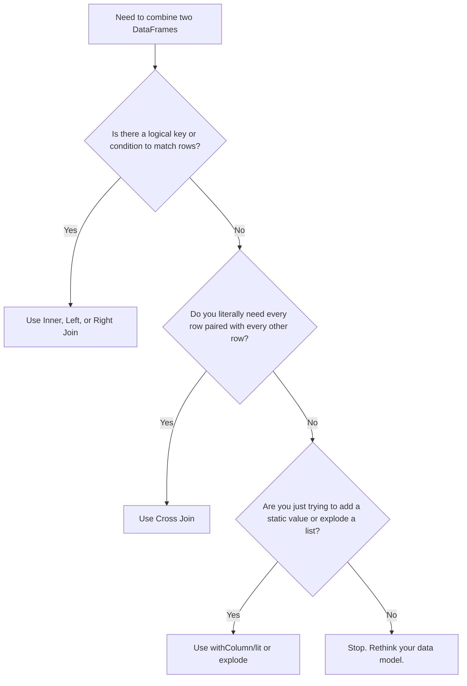

## 2.1.4 What is a Cross Join and why should it generally be avoided

A Cross Join creates a Cartesian product, pairing every single row in the left DataFrame with every row in the right. It’s usually a massive red flag in interviews because it causes exponential data explosion and OutOfMemory (OOM) crashes, unless you explicitly need to generate all possible combinations.

### 0. Setup

```python
from pyspark.sql import SparkSession

# Spark disables cross joins by default to prevent accidental cluster crashes. 
# We enable it here just to run the example.
spark = SparkSession.builder.config("spark.sql.crossJoin.enabled", "true").getOrCreate()

# Left DataFrame: 3 Colors
colors = spark.createDataFrame([("Red",), ("Blue",), ("Green",)], ["color"])

# Right DataFrame: 3 Sizes
sizes = spark.createDataFrame([("S",), ("M",), ("L",)], ["size"])
```

### 1. Core Concept & Decision Tree (CRITICAL)

Before you write a cross join, use this tree to verify you actually need one. Most of the time, you're using the wrong tool for the job.



### 2. Syntax & Implementation

```python
# Method 1: Explicit crossJoin method (Preferred, bypasses the safety config check)
cross_df = colors.crossJoin(sizes)

# Method 2: Using the standard join method with how="cross"
# Note: This respects the spark.sql.crossJoin.enabled config and will fail if it's false.
cross_df_alt = colors.join(sizes, how="cross")

cross_df.show()
```

### 3. Exact Output

```python
# Output:
# 3 colors * 3 sizes = 9 rows. 
# Every color is paired with every size.
# +-----+----+
# |color|size|
# +-----+----+
# |  Red|   S|
# |  Red|   M|
# |  Red|   L|
# | Blue|   S|
# | Blue|   M|
# | Blue|   L|
# |Green|   S|
# |Green|   M|
# |Green|   L|
# +-----+----+
```

### 4. Interview Pro-Tips / Gotchas

*   **The "Safety Catch" Trap:** Spark disables cross joins by default (`spark.sql.crossJoin.enabled = false`). If you get a `CartesianProduct` analysis exception in production, it’s not a bug; it’s Spark saving your cluster from an OOM crash. Never just flip this config to `true` in a PR without auditing the query. If an interviewer asks how to fix a Cartesian error, tell them to rewrite the query, not just toggle the config.
*   **The "Wrong Tool" Fallacy:** 90% of the time a dev asks for a cross join, they are trying to add a static column to every row or apply a tiny lookup table. If you're cross-joining a 1-billion row table with a 5-row config table, you're doing it wrong. Use `broadcast()` on the small table with a dummy join key, or just use `withColumn` and `lit()`. 
*   **First Principles of the Shuffle:** A standard join filters data *during* the shuffle, meaning only matching keys cross the network. A cross join has no filter. Every single row crosses the network to pair with every other row. The network I/O and memory footprint scale at $O(N \times M)$. If your left table is 10GB and right is 10GB, you just asked Spark to process 100GB+ of intermediate data. Always calculate the final row count in your head before executing.
