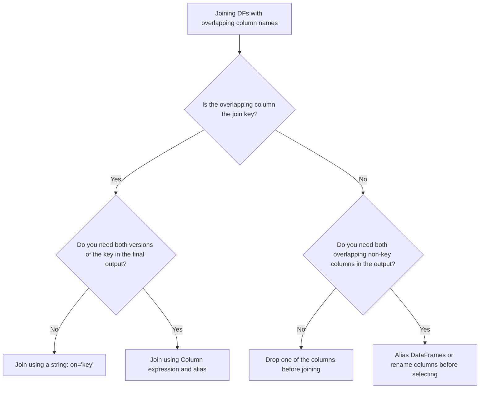

# 2.1.5 How do you handle joining two DataFrames that have a column with the exact same name

Joining DataFrames with overlapping column names creates ambiguous references that will instantly break downstream transformations. You must resolve these collisions either by deduplicating the join key, aliasing the DataFrames, or renaming columns before the join.

### 0. Setup

```python
from pyspark.sql import SparkSession

spark = SparkSession.builder.getOrCreate()

# Left DataFrame: Employees
emp_df = spark.createDataFrame([
    (1, "Alice", 101),
    (2, "Bob", 102)
], ["emp_id", "name", "dept_id"])

# Right DataFrame: Departments
# Notice it shares BOTH 'dept_id' (the join key) and 'name' (a non-key column)
dept_df = spark.createDataFrame([
    (101, "Engineering", "Tech"),
    (102, "Sales", "Revenue")
], ["dept_id", "name", "category"])
```

### 1. Core Concept & Decision Tree (CRITICAL)

When you hit an `AnalysisException: Reference 'X' is ambiguous`, use this tree to figure out the cleanest way to resolve the collision.



### 2. Syntax & Implementation

```python
from pyspark.sql.functions import col

# BAD: Joining on a Column expression keeps BOTH join keys and creates ambiguity for 'name'
# bad_join = emp_df.join(dept_df, on=emp_df.dept_id == dept_df.dept_id)

# GOOD 1: Joining on a string automatically deduplicates the join key ('dept_id')
# However, the non-key column 'name' is still duplicated and ambiguous!
good_key_join = emp_df.join(dept_df, on="dept_id")

# GOOD 2: Aliasing to resolve non-key column ambiguity ('name')
# This is the cleanest, most robust approach for complex joins.
aliased_join = emp_df.alias("emp").join(
    dept_df.alias("dept"),
    on="dept_id"
).select(
    col("dept_id"),
    col("emp.name").alias("emp_name"),
    col("dept.name").alias("dept_name"),
    col("dept.category")
)

aliased_join.show()
```

### 3. Exact Output

```python
# Output:
# +-------+--------+-----------+--------+
# |dept_id|emp_name|  dept_name|category|
# +-------+--------+-----------+--------+
# |    101|   Alice|Engineering|    Tech|
# |    102|     Bob|      Sales| Revenue|
# +-------+--------+-----------+--------+
```

### 4. Interview Pro-Tips / Gotchas

*   **The "String vs Column" Trap:** This is the #1 reason juniors fail Spark interviews. `df1.join(df2, df1.id == df2.id)` keeps *both* `id` columns in the schema. `df1.join(df2, "id")` keeps only *one*. If you use the Column expression, downstream code like `.filter(col("id") > 5)` will throw an `Ambiguous reference` error. Always use string joins for standard equi-joins.
*   **First Principles (Catalyst Optimizer):** When you use a string join, Spark's Catalyst optimizer automatically drops the right-side join key during the physical execution plan. When you use a Column expression, Spark treats them as two distinct columns that just happen to share a name, forcing it to shuffle and store both across the network. String joins save memory and I/O.
*   **Pandas vs Spark:** In Pandas, `pd.merge` automatically adds suffixes (`_x`, `_y`) to overlapping non-key columns to prevent crashes. Spark *does not do this*. Spark leaves them as identical column names in the schema, which breaks everything until you explicitly alias or rename them. Never assume Spark will save you from naming collisions; you have to handle it manually.
