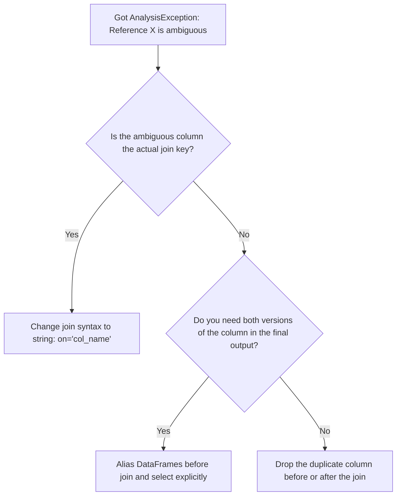

# 2.1.8 How do you resolve ambiguous column name errors after a join

Ambiguous column errors (`AnalysisException: Reference 'X' is ambiguous`) happen when a join creates duplicate column names and downstream operations don't know which one to pick. You resolve them by aliasing DataFrames before the join, using string-based join keys, or explicitly dropping the duplicates.

### 0. Setup

```python
from pyspark.sql import SparkSession

spark = SparkSession.builder.getOrCreate()

# Left DataFrame: Employees
emp_df = spark.createDataFrame([
    (1, "Alice", 10), 
    (2, "Bob", 20)
], ["id", "name", "dept_id"])

# Right DataFrame: Departments
# Notice it shares BOTH 'dept_id' (the join key) and 'name' (a non-key column)
dept_df = spark.createDataFrame([
    (10, "Engineering", "NY"), 
    (20, "Sales", "SF")
], ["dept_id", "name", "location"])
```

### 1. Core Concept & Decision Tree (CRITICAL)

When you hit an ambiguous reference error, don't just guess. Use this tree to figure out the cleanest way to resolve the collision based on what you actually need in the final output.



### 2. Syntax & Implementation

```python
from pyspark.sql.functions import col

# BAD: Column expression keeps both 'dept_id's, causing ambiguity later
# bad_df = emp_df.join(dept_df, emp_df.dept_id == dept_df.dept_id)
# bad_df.select("dept_id") # <-- This will crash with AnalysisException

# FIX 1: String join automatically deduplicates the join key ('dept_id')
string_join_df = emp_df.join(dept_df, on="dept_id")

# FIX 2: Aliasing for non-key overlaps ('name')
# We alias the DataFrames BEFORE the join, then use those aliases in the select
aliased_df = emp_df.alias("e").join(
    dept_df.alias("d"),
    on="dept_id"
).select(
    col("dept_id"),
    col("e.name").alias("emp_name"),
    col("d.name").alias("dept_name"),
    col("d.location")
)

aliased_df.show()
```

### 3. Exact Output

```python
# Output:
# +-------+--------+-----------+--------+
# |dept_id|emp_name|  dept_name|location|
# +-------+--------+-----------+--------+
# |     10|   Alice|Engineering|      NY|
# |     20|     Bob|      Sales|      SF|
# +-------+--------+-----------+--------+
```

### 4. Interview Pro-Tips / Gotchas

*   **The "String vs Column" First Principle:** When you use `on="dept_id"`, Spark's Catalyst optimizer knows it's an equi-join on the same logical attribute and drops the right-side key during the physical shuffle. When you use `on=df1.dept_id == df2.dept_id`, Spark treats them as two completely separate columns that just happen to have the same name. It shuffles both, wastes memory, and breaks downstream `select("dept_id")` calls. Always use string joins for standard equi-joins.
*   **The Downstream BI/dbt Trap:** Spark actually lets you create a DataFrame with duplicate column names in memory. But the moment you try to write it to a Delta table, expose it via a SQL view, or read it in dbt/Tableau, it blows up because SQL doesn't allow duplicate column names in a result set. Clean your schema *before* the write action, not after.
*   **Pandas vs Spark:** Pandas is a babysitter; if you merge on overlapping non-key columns, it automatically slaps `_x` and `_y` suffixes on them so your code doesn't break. Spark doesn't hold your hand. It leaves both `name` columns in the schema and waits for you to trip over them. You have to manually alias or drop them. Don't expect Spark to save you from naming collisions.
