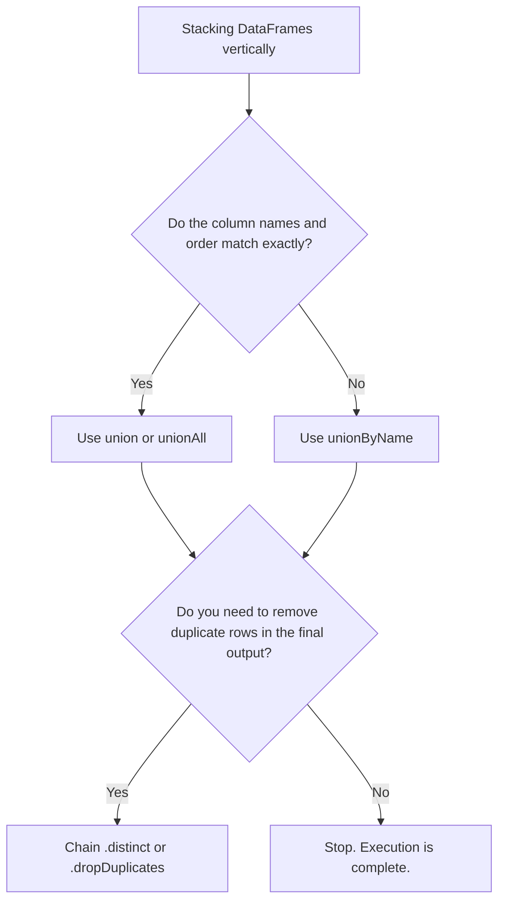

# 2.10.1 What is the difference between union() and unionAll() in PySpark

In modern PySpark (2.0+), `union()` and `unionAll()` do the exact same thing: they stack DataFrames vertically and keep all duplicate rows. The only difference is historical naming. The real interview trap isn't choosing between the two; it's knowing how to handle schema mismatches and whether you actually need to deduplicate the result.

### 0. Setup

```python
from pyspark.sql import SparkSession

spark = SparkSession.builder.getOrCreate()

# Left DataFrame: Q1 Sales
q1_sales = spark.createDataFrame([
    (1, "Laptop", 1000),
    (2, "Phone", 500),
    (2, "Phone", 500) # Duplicate row
], ["id", "product", "revenue"])

# Right DataFrame: Q2 Sales (Notice the columns are in a different order)
q2_sales = spark.createDataFrame([
    ("Tablet", 3, 800),
    ("Phone", 2, 500)
], ["product", "id", "revenue"])
```

### 1. Core Concept & Decision Tree (CRITICAL)

When stacking DataFrames, use this tree to avoid silent data corruption and schema mismatches.



### 2. Syntax & Implementation

```python
# 1. union() and unionAll() are identical in Spark 2.0+. 
# They match columns strictly by POSITION (index), not by name.
# WARNING: Look at the output below. The data is silently corrupted because 
# q2_sales has 'product' in the first column, but q1_sales expects 'id'.
positional_union = q1_sales.union(q2_sales) 

# 2. unionByName() matches columns by their NAME, ignoring order.
# This is almost always what you actually want in production.
name_union = q1_sales.unionByName(q2_sales)

# 3. If you need a true SQL "UNION" (which removes duplicates), 
# you must explicitly chain .distinct().
distinct_union = q1_sales.unionByName(q2_sales).distinct()

name_union.show()
distinct_union.show()
```

### 3. Exact Output

```python
# Output for name_union.show():
# Notice how 'Phone' 500 appears twice. unionByName keeps duplicates.
# +-------+---+-------+
# |product| id|revenue|
# +-------+---+-------+
# | Laptop|  1|   1000|
# |  Phone|  2|    500|
# |  Phone|  2|    500|
# | Tablet|  3|    800|
# |  Phone|  2|    500|
# +-------+---+-------+

# Output for distinct_union.show():
# The duplicate 'Phone' rows are collapsed into one.
# +-------+---+-------+
# |product| id|revenue|
# +-------+---+-------+
# |  Phone|  2|    500|
# | Tablet|  3|    800|
# | Laptop|  1|   1000|
# +-------+---+-------+

# (If you ran positional_union.show(), it would crash or return garbage 
# because it tries to cast "Tablet" into an integer 'id' column).
```

### 4. Interview Pro-Tips / Gotchas

*   **The "Identical Twins" Trap:** Interviewers love to ask "What's the difference between `union` and `unionAll`?" to see if you'll confidently give a wrong answer. In Spark 1.x, `unionAll` kept duplicates and `union` removed them. In Spark 2.0+, they changed it to match standard SQL, making `union` keep duplicates, and kept `unionAll` purely as a deprecated alias for backward compatibility. Under the hood, they compile to the exact same physical plan. 
*   **The Silent Schema Corruption:** `union()` matches by column index (0 to 0, 1 to 1). If your upstream engineer adds a column to the left DataFrame but not the right, `union()` won't throw an error—it will just silently shift your data into the wrong columns, turning strings into nulls or ints. Always use `unionByName(allowMissingColumns=True)` in production to bulletproof your pipelines against schema drift.
*   **First Principles (The Shuffle Tax):** Just like in SQL, a standard `UNION` requires a `DISTINCT` operation. In Spark, `.distinct()` forces a full cluster shuffle to hash and group all rows across all partitions to find duplicates. If you know your data is already unique, or if you only care about aggregates downstream, skip `.distinct()`. Don't pay the network I/O tax for deduplication if the business logic doesn't strictly require it.
