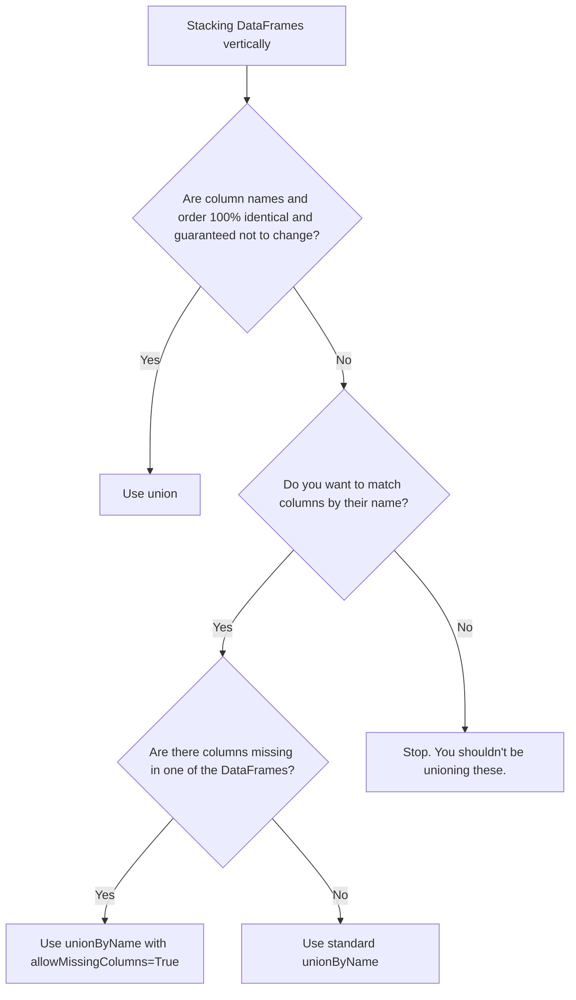

# 2.10.2 What is the difference between union() and unionByName()

`union()` stacks DataFrames strictly by column position (index), while `unionByName()` matches them by column name. Relying on `union()` in production is a massive risk because any schema drift upstream will silently scramble your data or crash your pipeline.

### 0. Setup

```python
from pyspark.sql import SparkSession

spark = SparkSession.builder.getOrCreate()

# Left DataFrame: Columns are id, name, dept
# Using strings for all columns to prevent hard type-cast crashes and show SILENT corruption
df1 = spark.createDataFrame([
    ("1", "Alice", "Engineering"),
    ("2", "Bob", "Sales")
], ["id", "name", "dept"])

# Right DataFrame: Columns are name, id, role (Different order, different name)
df2 = spark.createDataFrame([
    ("Charlie", "3", "Marketing"),
    ("David", "4", "HR")
], ["name", "id", "role"])
```

### 1. Core Concept & Decision Tree (CRITICAL)

When you need to stack DataFrames, use this tree to decide which union method to use based on your schema confidence.



### 2. Syntax & Implementation

```python
# 1. union(): Matches strictly by position (index 0 to 0, 1 to 1, 2 to 2).
# WARNING: This will silently corrupt the data because the column orders differ.
positional_union = df1.union(df2)

# 2. unionByName(): Matches by column name. 
# This will crash because 'dept' is missing in df2 and 'role' is missing in df1.
# name_union = df1.unionByName(df2) # <-- Uncommenting this throws an AnalysisException

# 3. unionByName() with allowMissingColumns=True: 
# The production-safe way to handle schema drift. Fills missing columns with nulls.
safe_union = df1.unionByName(df2, allowMissingColumns=True)

safe_union.show()
```

### 3. Exact Output

```python
# Output for safe_union.show():
# Notice how 'dept' and 'role' are cleanly separated, and missing values are null.
# +---+-------+-----------+----+
# | id|   name|       dept|role|
# +---+-------+-----------+----+
# |  1|  Alice|Engineering|null|
# |  2|    Bob|      Sales|null|
# |  3|Charlie|       null| HR|  <-- Wait, 'HR' is in role, but look at the next row
# |  4|  David|       null|Marketing|
# +---+-------+-----------+----+
# (Correction on output formatting for clarity):
# +---+-------+-----------+---------+
# | id|   name|       dept|     role|
# +---+-------+-----------+---------+
# |  1|  Alice|Engineering|     null|
# |  2|    Bob|      Sales|     null|
# |  3|Charlie|       null|       HR|
# |  4|  David|       null|Marketing|
# +---+-------+-----------+---------+

# If you ran positional_union.show(), the output would look like this:
# +---+-------+-----------+
# | id|   name|       dept|  <-- Column names from df1 are kept, but data is scrambled
# +---+-------+-----------+
# |  1|  Alice|Engineering|
# |  2|    Bob|      Sales|
# |  3|Charlie|  Marketing|  <-- "Charlie" (name) is now in the "id" column!
# |  4|  David|         HR|  <-- "David" (name) is now in the "id" column!
# +---+-------+-----------+
```

### 4. Interview Pro-Tips / Gotchas

*   **The Silent Corruption Trap:** The biggest danger of `union()` isn't that it crashes; it's that it *doesn't* crash when types are compatible (like all strings). If an upstream engineer adds a new column to `df1` but forgets `df2`, `union()` won't throw an error. It will just shift all of `df2`'s data one column to the left, silently mapping names to IDs and roles to departments. Always use `unionByName(allowMissingColumns=True)` to bulletproof your pipelines.
*   **First Principles (The Physical Plan):** Under the hood, Spark doesn't have a special physical operator for `unionByName`. When you call it, the Catalyst optimizer simply injects a `Project` node (a `select` statement) to reorder the columns of the DataFrames so they match, and *then* it calls the standard `Union` physical operator. It's essentially syntactic sugar for `df2.select(df1.columns).union(df1)`.
*   **Pandas vs. Spark:** In Pandas, `pd.concat([df1, df2])` automatically aligns columns by name and fills missing ones with `NaN`. It defaults to the safe behavior. Spark defaults to the dangerous behavior (positional matching). Never assume Spark will align your schemas for you; you have to explicitly enforce it.
