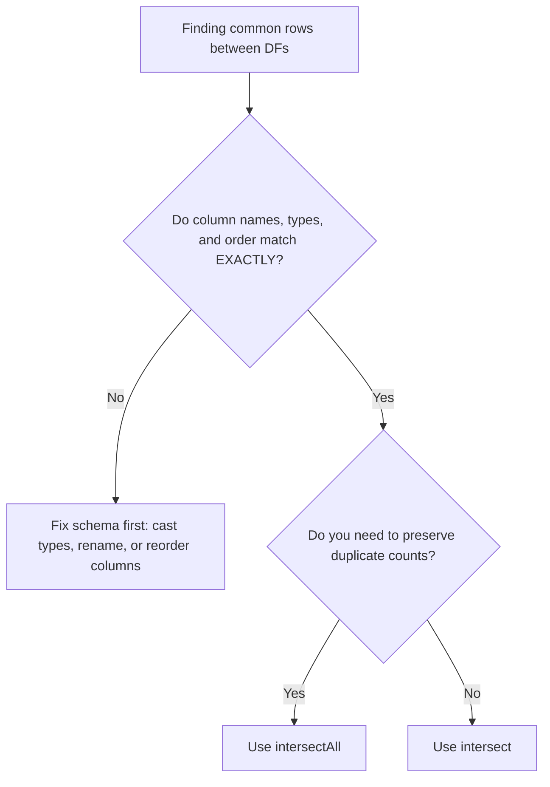

# 2.10.3 How do you find the common rows between two DataFrames

To find exact row matches between two DataFrames, you use `intersect()` or `intersectAll()`. They act as the PySpark equivalents to SQL's `INTERSECT` and `INTERSECT ALL`. The critical distinction is whether you need to preserve duplicate row counts or collapse them.

### 0. Setup

```python
from pyspark.sql import SparkSession

spark = SparkSession.builder.getOrCreate()

# Left DataFrame: Contains duplicates and a null value
df1 = spark.createDataFrame([
    (1, "A"),
    (2, "B"),
    (2, "B"), # Duplicate
    (None, "C")
], ["id", "val"])

# Right DataFrame: Overlaps with df1, also has duplicates and a null
df2 = spark.createDataFrame([
    (2, "B"),
    (2, "B"), # Duplicate
    (3, "D"),
    (None, "C")
], ["id", "val"])
```

### 1. Core Concept & Decision Tree (CRITICAL)

Before using set operations, verify your schemas and decide how you want to handle duplicates. 



### 2. Syntax & Implementation

```python
# 1. intersect(): Finds common rows and DEDUPLICATES the result.
# Equivalent to SQL INTERSECT.
common_deduped = df1.intersect(df2)

# 2. intersectAll(): Finds common rows and KEEPS duplicates.
# If a row appears twice in df1 and twice in df2, it appears twice in the output.
# Equivalent to SQL INTERSECT ALL.
common_with_dupes = df1.intersectAll(df2)

# Show the results
common_deduped.show()
common_with_dupes.show()
```

### 3. Exact Output

```python
# Output for common_deduped.show():
# (2, B) and (None, C) are the common rows. Duplicates are collapsed.
# +----+---+
# |  id|val|
# +----+---+
# |   2|  B|
# |null|  C|
# +----+---+

# Output for common_with_dupes.show():
# (2, B) appears twice because it appeared twice in BOTH DataFrames.
# (None, C) appears once.
# +----+---+
# |  id|val|
# +----+---+
# |   2|  B|
# |   2|  B|
# |null|  C|
# +----+---+
```

### 4. Interview Pro-Tips / Gotchas

*   **The Null Handling Trap:** This is a classic interview curveball. In a standard `join`, `null == null` evaluates to `UNKNOWN`, so null keys don't match. But in `intersect()`, Spark treats `null` as strictly equal to `null`. If your interviewer asks why your join dropped nulls but your intersect kept them, it's because set operations use value-based equality, not SQL's 3-valued logic.
*   **First Principles (The Shuffle Tax):** `intersect()` is expensive. Under the hood, Spark has to union the two DataFrames, hash all the rows, shuffle them across the network, and perform a `distinct` operation to find the overlaps. If you only care about matching on a *primary key* (not the entire row), do not use `intersect`. Use a `Left Semi Join` instead. A semi join only checks for key existence and skips the massive payload shuffle of comparing every single column.
*   **Schema Strictness vs. Union:** Unlike `unionByName()`, which forgives column order and missing columns, `intersect()` is ruthless. The column names, data types, and exact column order must match 100%. If `df1` has `(id: int, val: string)` and `df2` has `(val: string, id: int)`, `intersect()` will fail or silently compare the wrong columns. Always align your schemas explicitly before running set operations.
