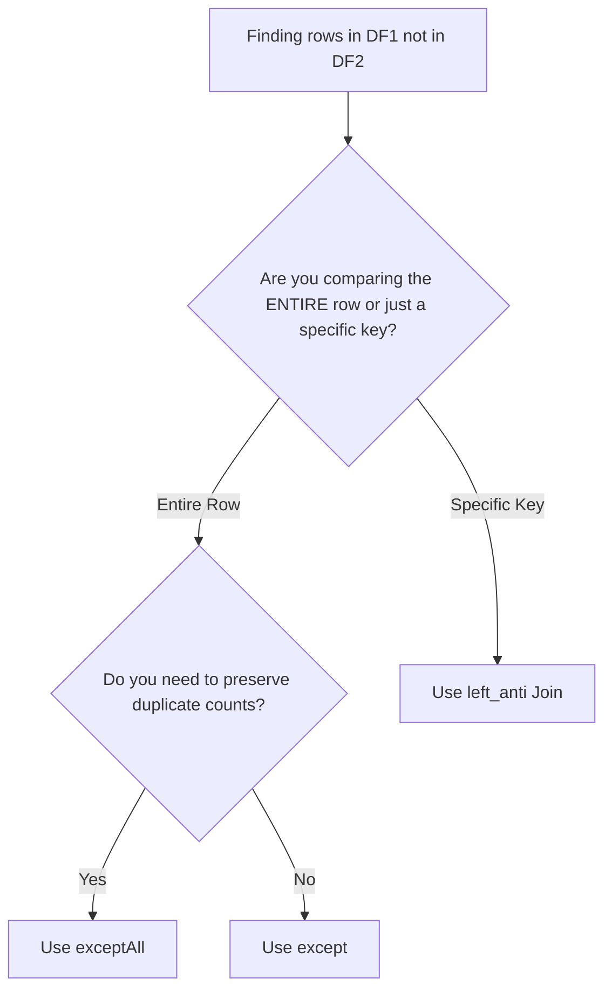

# 2.10.4 How do you find rows that exist in df1 but not in df2

To find rows in the first DataFrame that are missing from the second, use `except()` or `exceptAll()` for full-row comparisons, or a `left_anti` join for key-based lookups. Choosing the wrong one will either crash your pipeline with schema errors or melt your cluster with unnecessary shuffles.

### 0. Setup

```python
from pyspark.sql import SparkSession

spark = SparkSession.builder.getOrCreate()

# Left DataFrame: Contains duplicates
df1 = spark.createDataFrame([
    (1, "Alice"),
    (2, "Bob"),
    (2, "Bob"), # Duplicate row
    (3, "Charlie")
], ["id", "name"])

# Right DataFrame: Notice id=2 has a DIFFERENT name ("Bobby")
df2 = spark.createDataFrame([
    (2, "Bobby"), 
    (4, "David")
], ["id", "name"])
```

### 1. Core Concept & Decision Tree (CRITICAL)

Before writing the code, use this tree to decide whether you need a full-row set operation or a targeted key-based join.



### 2. Syntax & Implementation

```python
# 1. except(): Full row comparison, DEDUPLICATES the result.
# Since (2, "Bob") != (2, "Bobby"), the row is kept. Duplicates are collapsed.
diff_deduped = df1.except(df2)

# 2. exceptAll(): Full row comparison, KEEPS duplicates.
# df1 has two (2, "Bob") rows. The result keeps both.
diff_with_dupes = df1.exceptAll(df2)

# 3. left_anti Join: Key-based comparison.
# We only check if the 'id' exists in df2. It ignores the 'name' column completely.
diff_by_key = df1.join(df2, on="id", how="left_anti")

diff_deduped.show()
diff_with_dupes.show()
diff_by_key.show()
```

### 3. Exact Output

```python
# Output for diff_deduped.show():
# (2, Bob) is kept because it doesn't exactly match (2, Bobby).
# The duplicate (2, Bob) is collapsed into one.
# +---+-------+
# | id|   name|
# +---+-------+
# |  1|  Alice|
# |  2|    Bob|
# |  3|Charlie|
# +---+-------+

# Output for diff_with_dupes.show():
# Same as above, but the duplicate (2, Bob) is preserved.
# +---+-------+
# | id|   name|
# +---+-------+
# |  1|  Alice|
# |  2|    Bob|
# |  2|    Bob|
# |  3|Charlie|
# +---+-------+

# Output for diff_by_key.show():
# CRITICAL DIFFERENCE: id=2 is completely gone! 
# Even though the names didn't match, the ID existed in df2, 
# so the left_anti join dropped ALL rows with id=2.
# +---+-------+
# | id|   name|
# +---+-------+
# |  1|  Alice|
# |  3|Charlie|
# +---+-------+
```

### 4. Interview Pro-Tips / Gotchas

*   **The "Full Row vs Key" Performance Trap:** This is the #1 performance killer in production. `except()` hashes and compares *every single column* in your DataFrame. If you have a 50-column table, Spark shuffles all 50 columns across the network just to find the difference. If you only care about the primary key, use a `left_anti` join. It only hashes the key, saving massive network I/O and CPU.
*   **The Schema Strictness Rule:** Unlike `unionByName()`, which forgives column order and missing columns, `except()` is ruthless. The column names, data types, and exact column order must match 100%. If `df1` has `(id: int, name: string)` and `df2` has `(name: string, id: int)`, `except()` will fail or silently compare the wrong columns. Always align your schemas explicitly before running set operations.
*   **Null Handling Consistency:** Just like `intersect()`, `except()` treats `null` as strictly equal to `null`. If `df1` has a row with a null value, and `df2` has the exact same row with a null value, `except()` will remove it. This is different from a standard `left_anti` join on a null key, which would fail to match and keep the row. Know your null semantics.
