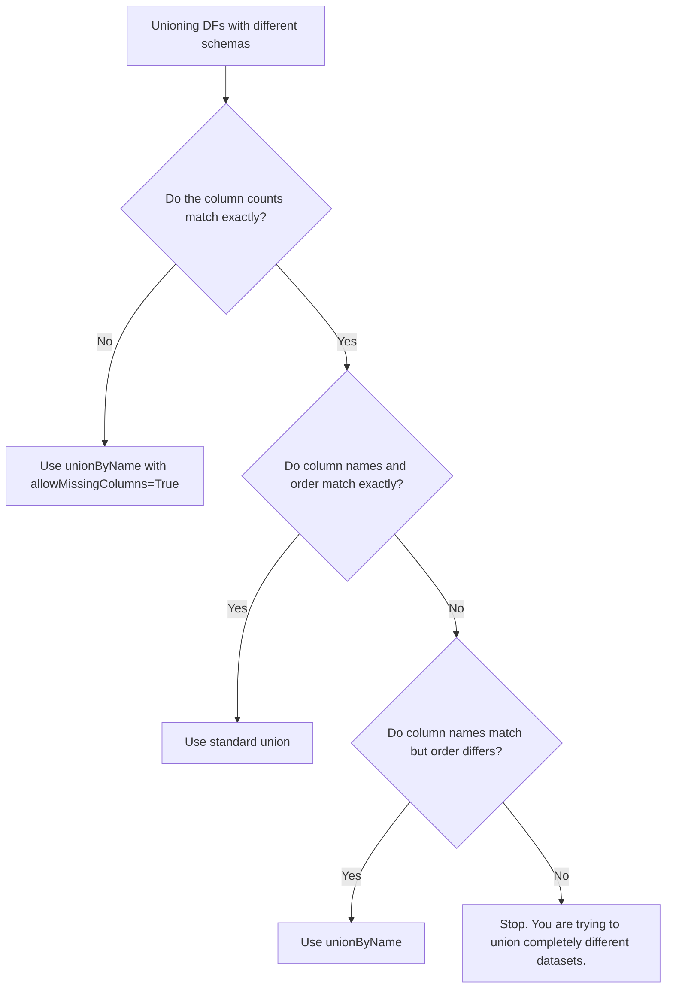

# 2.10.5 What happens if you union two DataFrames with different schemas

Unioning DataFrames with mismatched schemas will either silently corrupt your data through positional matching or instantly crash your pipeline with an `AnalysisException`. Spark is strictly typed and positionally rigid; you must explicitly resolve column order, missing columns, and type mismatches before stacking them.

### 0. Setup

```python
from pyspark.sql import SparkSession

spark = SparkSession.builder.getOrCreate()

# Left DataFrame: Columns are id, name, dept (All strings for this example)
df1 = spark.createDataFrame([
    ("1", "Alice", "Engineering"),
    ("2", "Bob", "Sales")
], ["id", "name", "dept"])

# Right DataFrame: Columns are name, id, role (Different order, missing 'dept', extra 'role')
df2 = spark.createDataFrame([
    ("Charlie", "3", "Marketing"),
    ("David", "4", "HR")
], ["name", "id", "role"])
```

### 1. Core Concept & Decision Tree (CRITICAL)

When schemas don't match, don't just guess which union method to use. Run them through this logic to prevent data loss or pipeline crashes.



### 2. Syntax & Implementation

```python
# 1. THE TRAP: Standard union() matches strictly by position (index 0 to 0, 1 to 1).
# Because column counts match (3 columns), this won't crash, but it silently corrupts the data.
positional_union = df1.union(df2)

# 2. THE CRASH: unionByName() matches by name, but fails if columns are missing.
# This throws: AnalysisException: Union can only be performed on tables with the compatible column types. 
# (Or missing column errors depending on Spark version).
# name_union = df1.unionByName(df2) 

# 3. THE FIX: unionByName() with allowMissingColumns=True.
# This aligns columns by name and fills missing columns with nulls.
safe_union = df1.unionByName(df2, allowMissingColumns=True)

safe_union.show()
```

### 3. Exact Output

```python
# Output for safe_union.show():
# Columns are perfectly aligned by name. Missing columns are filled with nulls.
# +---+-------+-----------+---------+
# | id|   name|       dept|     role|
# +---+-------+-----------+---------+
# |  1|  Alice|Engineering|     null|
# |  2|    Bob|      Sales|     null|
# |  3|Charlie|       null|Marketing|
# |  4|  David|       null|       HR|
# +---+-------+-----------+---------+

# Output for positional_union.show() (The Silent Corruption):
# Notice how the schema from df1 is kept, but the data from df2 is shifted left.
# "Charlie" (a name) is now in the "id" column. "Marketing" (a role) is in "dept".
# +---+-------+-----------+
# | id|   name|       dept|
# +---+-------+-----------+
# |  1|  Alice|Engineering|
# |  2|    Bob|      Sales|
# |  3|Charlie|  Marketing|  <-- SILENT CORRUPTION
# |  4|  David|         HR|  <-- SILENT CORRUPTION
# +---+-------+-----------+
```

### 4. Interview Pro-Tips / Gotchas

*   **The "Missing Columns vs Type Mismatch" Reality Check:** `allowMissingColumns=True` is a lifesaver for schema drift (added/dropped columns), but it does **not** fix type mismatches. If `df1.id` is an integer and `df2.id` is a string, `unionByName` will still violently crash with an `AnalysisException`. You must explicitly cast columns to matching types (e.g., using `df2.withColumn("id", col("id").cast("int"))`) before the union.
*   **First Principles (The Catalyst Project Node):** Spark doesn't have a magical "smart merge" physical operator. When you use `unionByName(allowMissingColumns=True)`, the Catalyst optimizer simply injects a `Project` node (a `SELECT` statement) into the logical plan. It reorders the columns to match the left DataFrame and injects `null` literals for the missing ones, and *then* it passes that to the standard physical `Union` operator. It's just syntactic sugar for `df2.select(...).union(df1)`.
*   **Pandas vs. Spark:** In Pandas, `pd.concat([df1, df2])` automatically aligns by column name and fills missing data with `NaN` by default. It assumes you want the safe behavior. Spark assumes you want the fast, positional behavior and will happily let you corrupt your data if you don't explicitly enforce `unionByName`. Never assume Spark will align your schemas for you.
