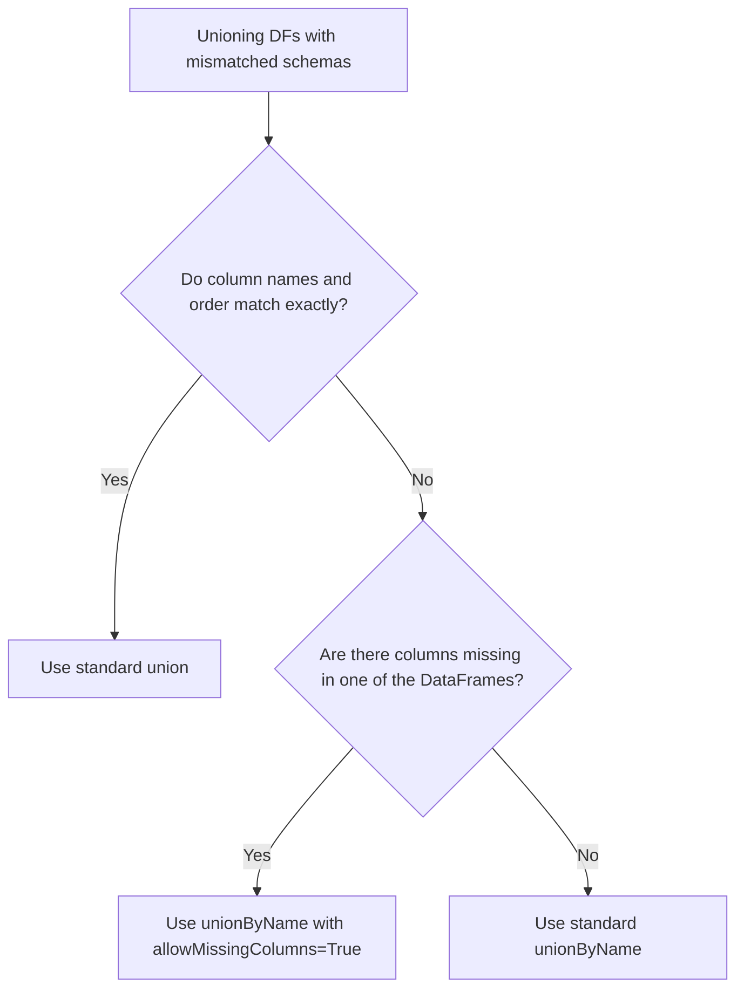

# 2.10.6 How do you allow missing columns when using unionByName()

You use the `allowMissingColumns=True` parameter to safely stack DataFrames with different schemas without crashing. It aligns columns by name and fills any missing columns with nulls, making it the ultimate shield against upstream schema drift in production pipelines.

### 0. Setup

```python
from pyspark.sql import SparkSession

spark = SparkSession.builder.getOrCreate()

# Left DataFrame: Has 'dept', but no 'role'
df1 = spark.createDataFrame([
    (1, "Alice", "Engineering"),
    (2, "Bob", "Sales")
], ["id", "name", "dept"])

# Right DataFrame: Missing 'dept', but has an extra 'role' column
df2 = spark.createDataFrame([
    (3, "Charlie", "Marketing"),
    (4, "David", "HR")
], ["id", "name", "role"])
```

### 1. Core Concept & Decision Tree (CRITICAL)

When your schemas don't match, use this tree to pick the exact union method you need so you don't accidentally corrupt data or crash the job.



### 2. Syntax & Implementation

```python
# 1. THE CRASH: Standard unionByName fails if columns are missing.
# This throws an AnalysisException because 'dept' is missing in df2 and 'role' is missing in df1.
# standard_name_union = df1.unionByName(df2) 

# 2. THE FIX: Pass allowMissingColumns=True.
# This tells Spark to align by name and pad the missing columns with nulls.
safe_union = df1.unionByName(df2, allowMissingColumns=True)

safe_union.show()
```

### 3. Exact Output

```python
# Output for safe_union.show():
# Columns are aligned by name. 
# 'dept' is null for df2's rows, and 'role' is null for df1's rows.
# +---+-------+-----------+---------+
# | id|   name|       dept|     role|
# +---+-------+-----------+---------+
# |  1|  Alice|Engineering|     null|
# |  2|    Bob|      Sales|     null|
# |  3|Charlie|       null|Marketing|
# |  4|  David|       null|       HR|
# +---+-------+-----------+---------+
```

### 4. Interview Pro-Tips / Gotchas

*   **The "Missing vs Mismatched" Trap:** `allowMissingColumns=True` fixes *missing* columns, but it does absolutely nothing for *mismatched* data types. If `df1.id` is an integer and `df2.id` is a string, this parameter won't save you; Spark will still violently crash with an `AnalysisException`. You must explicitly cast columns to matching types before the union.
*   **First Principles (Catalyst Optimizer):** Spark doesn't have a magical "smart merge" physical operator. When you use this parameter, the Catalyst optimizer simply injects a `Project` node (a `SELECT` statement) into the logical plan. It reorders the right DataFrame's columns to match the left, and injects `null` literals for the missing ones, *then* passes it to the standard physical `Union` operator. It's just syntactic sugar for `df2.select(...).union(df1)`.
*   **The Output Schema Rule:** The final schema order is strictly dictated by the **left** DataFrame. Any extra columns from the right DataFrame are just appended to the very end. If you need a specific column order in your final Delta table or BI dashboard, chain a `.select()` after the union to enforce it.
