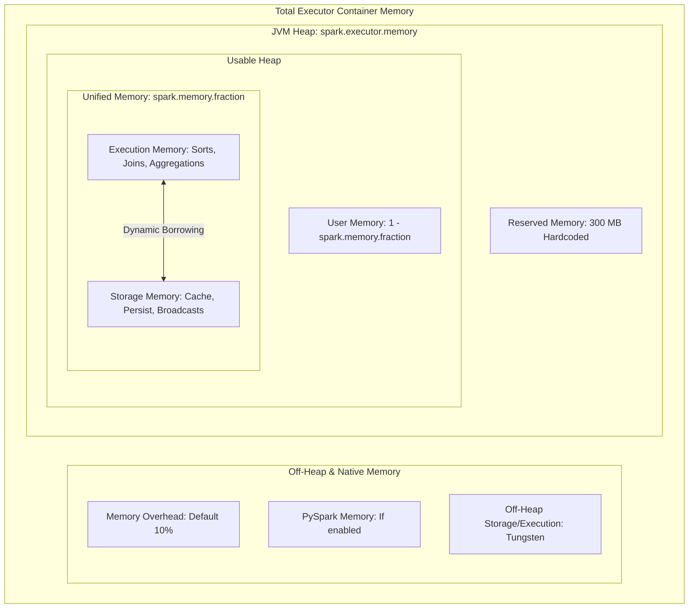

# 4.1.1 Describe the Spark Executor Memory architecture.

# 1. Spark Executor Memory Architecture

## Total Container Memory vs. JVM Heap

When running Spark on a resource manager (like YARN or Kubernetes), the total physical memory requested for an executor container is larger than the JVM heap size configured in your session.

*   **Total Container Memory Formula**: 
    $$\text{Container Memory} = \text{JVM Heap} + \text{Memory Overhead} + \text{Off-Heap Memory} + \text{PySpark Memory}$$
*   **JVM Heap (`spark.executor.memory`)**: The memory space allocated directly to the executor's JVM. This is where execution tasks, caching, and user objects live.
*   **Memory Overhead (`spark.executor.memoryOverhead`)**: Off-heap memory allocated per executor process. It accounts for native VM overheads, thread stacks, interned strings, and native memory allocations. It defaults to **10% of JVM Heap** or a minimum of 384 MB.
*   **Off-Heap Memory (`spark.memory.offHeap.size`)**: Optional off-heap memory used by Project Tungsten to allocate raw off-heap memory structures, bypassing JVM Garbage Collection. It must be enabled via `spark.memory.offHeap.enabled = true`.
*   **PySpark Memory (`spark.executor.pyspark.memory`)**: Set-aside memory for non-JVM Python worker processes when executing PySpark applications.

> [!WARNING]
> If your native JVM or custom code allocates off-heap memory that exceeds the `memoryOverhead` boundary, the underlying container engine (YARN/K8s NodeManager) will immediately terminate the container with an **Exit Code 137 / OOMKilled** error.

## JVM Heap Internal Breakdown

The JVM heap of the executor (`spark.executor.memory`) is divided into three primary segments designed to prevent Spark internal operations from clashing with user application code.

*   **Reserved Memory**: A hardcoded block of **300 MB**. This memory is strictly set aside to run Spark's internal system tasks (such as heartbeat monitoring and metadata tracking). It cannot be configured.
*   **User Memory**: Calculated as `(JVM Heap - 300 MB) * (1 - spark.memory.fraction)`. 
    *   This space is reserved for user-defined data structures inside your Spark application (e.g., hash maps created inside custom transformation code, UDF intermediate variables, and Spark metadata structures).
    *   It is also used to safeguard against Out of Memory (OOM) errors from JVM Garbage Collection.
*   **Unified Memory**: Calculated as `(JVM Heap - 300 MB) * spark.memory.fraction`. By default, `spark.memory.fraction` is set to **0.6 (60%)**. This unified pool manages active tasks, aggregations, joins, and caching.

> [!NOTE]
> If your custom driver/executor logic creates massive Java objects inside a custom `.map()` or `.filter()` function, that memory footprint is consumed directly out of the **User Memory** region, not the Unified Memory region.

## The Unified Memory Manager and Dynamic Borrowing

Within the Unified Memory space, Spark further divides the memory into **Execution Memory** and **Storage Memory**. They share a soft, dynamic boundary controlled by `spark.memory.storageFraction` (default **0.5 / 50%**).

*   **Execution Memory**: Used to store intermediate state data during active computations, such as shuffle buffers, sort matrices, hash maps for joins, and aggregation states.
*   **Storage Memory**: Used for storing cached data (via `.cache()` or `.persist()`), broadcast variables, and unrolling partition streams.
*   **Dynamic Borrowing Mechanism**:
    *   **Execution Borrows Storage**: If Execution memory is full but Storage memory has unused space, Execution can expand and borrow memory from Storage.
    *   **Storage Borrows Execution**: If Storage is full but Execution has unused space, Storage can similarly borrow from Execution.
    *   **Eviction Behavior (The Catch)**:
        *   If **Execution** needs memory borrowed by **Storage**, it forces an eviction. The cached storage blocks are written to disk or evicted from memory immediately.
        *   If **Storage** needs memory borrowed by **Execution**, it **cannot** force an eviction. Storage must wait until Execution completes its active task computation and naturally frees the memory.

> [!TIP]
> If your application relies heavily on complex joins and aggregations but does not use `.cache()`, you can increase `spark.memory.fraction` (to `0.8` or `0.9`) to allocate more JVM space for execution. At the same time, reduce `spark.memory.storageFraction` (to `0.1` or `0.2`) to prevent unused storage space from reserving RAM.
