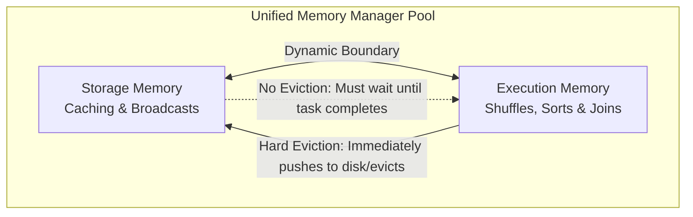

# 4.1.2 What is the Unified Memory Manager in Spark?

# 1. Spark Unified Memory Manager (UMM)

## Core Architecture and Partitioning

The **Unified Memory Manager (UMM)** is Spark's default memory management model. It replaced the legacy `StaticMemoryManager` to eliminate the need for users to configure hard, rigid boundaries between memory pools. 

UMM operates within the JVM heap of the executor. It dynamically divides a single unified memory space into two main workloads: **Execution** (calculating data during shuffles and joins) and **Storage** (caching data and hosting broadcast variables).

*   **Total Pool Size**: The Unified Memory Pool is allocated based on the formula:
    $$\text{Unified Memory Pool} = (\text{JVM Heap} - 300\text{ MB}) \times \text{spark.memory.fraction}$$
    *   By default, `spark.memory.fraction` is **0.6** (60% of usable heap).
*   **The Soft Boundary**: Within this pool, Spark sets a soft starting boundary controlled by:
    $$\text{Default Storage Pool} = \text{Unified Memory Pool} \times \text{spark.memory.storageFraction}$$
    *   By default, `spark.memory.storageFraction` is **0.5** (50% of the unified pool). The remaining 50% starts as the Execution pool.

> [!NOTE]
> Unlike the legacy memory manager, these boundaries are not hard walls. If one pool is empty, the other pool can temporarily claim up to 100% of the entire unified memory space.

## Dynamic Borrowing and Eviction Rules

The core innovation of UMM is the ability of Execution and Storage to borrow memory from each other on the fly. However, the rules governing how this borrowed memory is reclaimed are **asymmetrical**.

*   **Storage Borrows from Execution**:
    *   If Execution is idle, Storage can expand to cache more DataFrames.
    *   If Execution suddenly needs its space back, **Storage is immediately evicted**. The cached blocks are either written to disk (if the storage level is `MEMORY_AND_DISK`) or dropped from memory (requiring recomputation later).
*   **Execution Borrows from Storage**:
    *   If Storage is idle, Execution can expand to accommodate heavy shuffles, joins, or aggregations.
    *   If Storage suddenly wants its space back to cache a new DataFrame, **Storage cannot evict Execution**. 
    *   Storage must wait until Execution naturally completes its tasks and releases the memory.

> [!IMPORTANT]
> **Why this asymmetry?** Execution memory contains active pointer-heavy data structures (like shuffle map sorting outputs) that are highly pipelined and critical to task progress. Evicting active execution structures would abort running tasks, whereas evicting a cache block merely forces a recomputation or disk read later.

## Performance Tuning Strategies for Seniors

Understanding the asymmetric eviction behavior of UMM is key to resolving performance bottlenecks in production pipelines.

*   **Tuning Spill-Heavy Pipelines**:
    *   *Symptom*: High `Spill (Memory)` and `Spill (Disk)` in the Spark UI.
    *   *Analysis*: Your tasks do not have enough Execution memory to perform shuffles, forcing them to serialize data to local disk.
    *   *Tuning*: Reduce `spark.memory.storageFraction` to **0.1** or **0.2**. This guarantees that 80% to 90% of the Unified memory pool is dedicated strictly to Execution operations and is completely immune to eviction by cached data.
*   **Tuning Garbage Collection (GC) Overhead**:
    *   *Symptom*: Executor spending more than 10% of execution time in GC pauses.
    *   *Analysis*: If `spark.memory.fraction` is set too high (e.g., `0.8` or `0.9`), the remaining **User Memory** pool is squeezed down to 10% to 20%. This starves JVM garbage collection operations and user-defined objects, causing JVM thrashing.
    *   *Tuning*: Maintain the default `spark.memory.fraction = 0.6` to align with standard JVM Old/New Gen region ratios (which typically allocate 2/3 of the heap to Old Gen).

> [!TIP]
> If your pipeline relies on caching but experiences heavy memory eviction under UMM, change your DataFrame persistence level from `.cache()` (which defaults to deserialized memory) to `.persist(StorageLevel.MEMORY_AND_DISK_SER)`. Serialization significantly reduces the storage footprint, leaving more free space in the unified pool.
