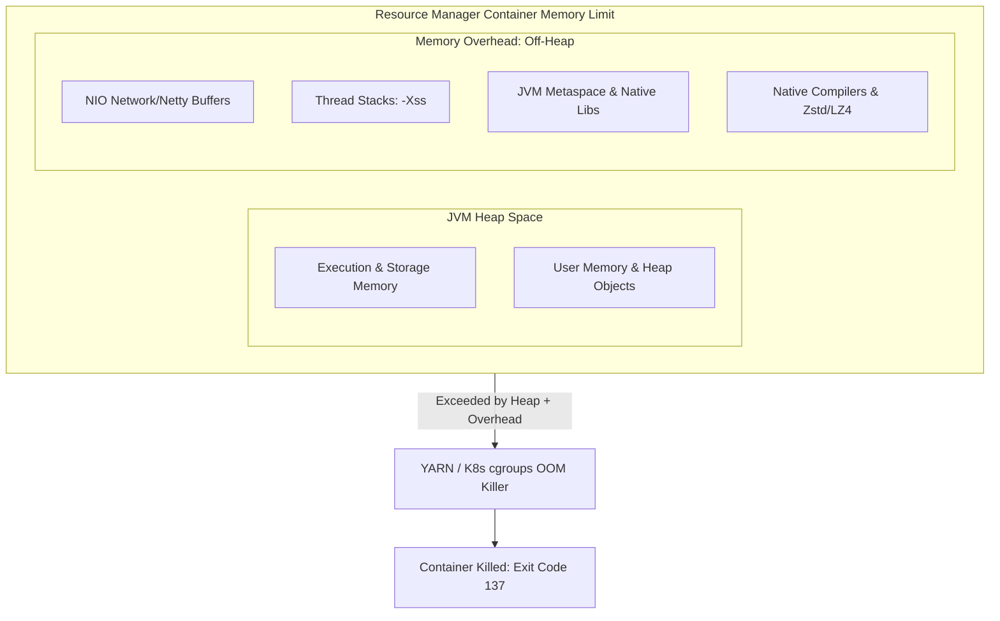

# 4.1.3 What is Executor Memory Overhead and when do you need to increase it?

# 1. Understanding Spark Executor Memory Overhead

## Core Purpose and Calculation

Executor Memory Overhead is an off-heap memory region allocated outside of the JVM heap for each executor container. It is managed at the container level by resource managers like YARN or Kubernetes.

*   **What It Is Used For**:
    *   **NIO Direct Buffers**: Used by Netty for network data transfers during shuffle write/read operations.
    *   **Thread Stacks**: Memory consumed by active threads (`-Xss` space). More executor cores mean a higher cumulative stack footprint.
    *   **Metaspace**: Holds JVM class metadata, method bytecodes, and constant pools.
    *   **Native Libraries**: JNI allocations used by native compression algorithms (Zstd, Snappy, LZ4) or Python libraries.
*   **How It Is Configured**:
    *   Managed globally using `spark.executor.memoryOverhead`.
    *   **Default Calculation**: It defaults to **10% of JVM Heap** (`spark.executor.memory`) or a **minimum of 384 MB**.
    *   Formula: 
        $$\text{Memory Overhead} = \max(384\text{ MB}, 0.10 \times \text{spark.executor.memory})$$

> [!NOTE]
> From Spark 3.0 onward, the memory allocated for Project Tungsten Off-Heap operations (`spark.memory.offHeap.size`) is managed as a separate entity. It is automatically added to the container request and does not consume your allocated `spark.executor.memoryOverhead`.

## Why Overhead Violations Trigger Exit Code 137

Unlike standard JVM heap out-of-memory errors which throw a traceable `java.lang.OutOfMemoryError: Java heap space` in your logs, memory overhead violations are managed forcefully.

*   **The Mechanism**: The total memory consumed by the executor process (the Resident Set Size or RSS) is monitored by the host system's kernel cgroups (under Kubernetes) or NodeManager (under YARN).
*   **The Reaction**: If the JVM heap usage plus native overhead usage exceeds the absolute container allocation, the platform sends a SIGKILL (`kill -9`) signal to the executor.
*   **The Signature**: The job fails with **Exit Code 137** and diagnostics like `Container killed on request` or `OOMKilled`. No Java stack trace is generated in the log files.

> [!WARNING]
> If you see `Exit Code 137` without a matching `Java heap space` exception, scaling up your `spark.executor.memory` may actually worsen the issue because it increases the JVM's potential heap utilization without increasing the native margin proportionally.

## Real-World Scenarios Requiring Overhead Customization

Under normal workloads, the 10% default is sufficient. However, complex production pipelines often hit edge cases that require adjusting the default configuration.

*   **Large Partition Sizes during Shuffles**:
    *   *Scenario*: High-volume shuffles with skewed keys.
    *   *Why*: Netty allocates massive off-heap Direct ByteBuffers to pipeline partition transfers across the network. If these buffers exceed the 10% limit, the executor is killed.
    *   *Fix*: Set `spark.executor.memoryOverhead` manually to 15% to 20% of your executor memory.
*   **High Core Count per Executor (`spark.executor.cores` > 5)**:
    *   *Scenario*: Allocating 8 to 16 cores per executor.
    *   *Why*: Running many parallel tasks on a single executor increases the active thread stack allocation (`-Xss` is usually 1MB per thread), rapidly exhausting the default overhead pool.
    *   *Fix*: Either reduce executor cores to 4 or 5, or increase the overhead memory.
*   **Heavy Use of PySpark / Non-JVM Libraries**:
    *   *Scenario*: Using custom Python libraries (like Pandas, NumPy, or ML libraries) inside PySpark workers.
    *   *Why*: Python processes are spawned as separate native processes on the worker node and allocate native C-memory outside the JVM heap.
    *   *Fix*: Explicitly allocate memory via `spark.executor.pyspark.memory` or scale up `spark.executor.memoryOverhead`.
*   **Metaspace Out Of Memory**:
    *   *Scenario*: Pipelines with massive nested schemas, thousands of SQL queries, or heavy use of dynamically generated code paths.
    *   *Why*: Spark's WholeStageCodegen generates Java compilation classes on the fly. This compiled bytecode is loaded into the JVM Metaspace, which sits inside the off-heap overhead region.
    *   *Fix*: Raise the overhead size and explicitly configure Metaspace limits using JVM options: `spark.executor.extraJavaOptions=-XX:MaxMetaspaceSize=512m`.
