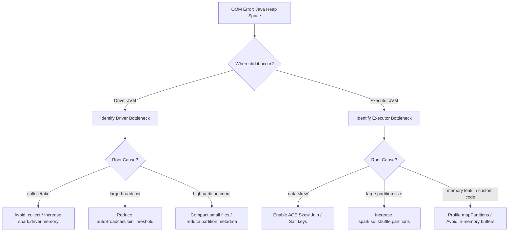

# 4.1.4 You get a java.lang.OutOfMemoryError Java heap space. How do you debug it?

# 1. Debugging Java Heap Space OOM

## Fork 1: Driver OOM vs. Executor OOM

The first step in debugging a `java.lang.OutOfMemoryError: Java heap space` is isolating whether the exception occurred on the **Driver** or on an **Executor**. 

Look at the stack trace and the log source:
*   **Driver OOM**: Usually happens at the very end of a query or job phase, often accompanied by stack traces involving `spark.collect()`, `SparkContext.broadcast()`, or `Metadata` loading.
*   **Executor OOM**: Occurs during active task execution. The stack trace is logged in the Executor `stderr` files and the driver reports an executor loss due to task failure.

---

## Debugging and Fixing Driver OOM

The Driver acts as the coordinator. If it runs out of heap space, it is almost always because it was forced to store actual dataset records or massive metadata trees in memory.

### 1. The `.collect()` or `.take()` Anti-Pattern
*   **The Issue**: Running `.collect()` pulls the entire distributed dataset from the executors into the single JVM of the Driver. If the data size exceeds `spark.driver.memory`, it crashes immediately.
*   **How to Debug**: Look for `.collect()`, `.toPandas()`, or `.take(N)` with a very large `N` in your user code.
*   **The Fix**: 
    *   Avoid bringing data to the driver. Write the output directly to storage (e.g., `.write.parquet()`).
    *   If you must analyze data on the driver, use aggregate functions (`.count()`, `.describe()`) to reduce the data volume first.

### 2. Massive Broadcast Joins
*   **The Issue**: When joining a large table with a small table, Spark may broadcast the small table to all executors. The driver must first collect and build the broadcast relation in its own heap before serializing and shipping it.
*   **How to Debug**: Check the SQL tab DAG for a `BroadcastExchange` node.
*   **The Fix**:
    *   Decrease `spark.sql.autoBroadcastJoinThreshold` (default is 10MB) to prevent moderately large tables from being broadcasted.
    *   Increase `spark.driver.memory` to handle the broadcast relation build-up.

### 3. File Metadata Explosion (Small File Problem)
*   **The Issue**: If you are reading or writing to a dataset with millions of tiny files or deeply nested partitions, the driver has to track the file paths, schemas, and block locations in its heap.
*   **How to Debug**: The driver JVM memory climbs steadily during the planning phase *before* any tasks actually run.
*   **The Fix**: Run a file compaction job upstream to merge small files into larger ones (ideally 128MB to 512MB).

> [!IMPORTANT]
> Increasing `spark.driver.memory` is a temporary bandage. If the root cause is a `.collect()` on an unbounded dataset, the driver will eventually OOM again as the source data grows.

---

## Debugging and Fixing Executor OOM

An Executor OOM means a single task partition allocated to that executor was too large to fit inside its assigned heap fraction.

### 1. Inefficient `mapPartitions` and Custom UDFs
*   **The Issue**: When using `.mapPartitions()`, developers often convert the input iterator to a standard Java/Scala collection (e.g., `iterator.toList` or `iterator.toArray`) to manipulate the data easily. This loads the entire partition into the heap at once, breaking Spark’s lazy pipelining.
*   **How to Debug**: Check custom transformation code inside your map partitions or UDF functions.
*   **The Fix**: 
    *   Process elements lazily inside `mapPartitions`. Keep the return type as an `Iterator` and avoid calling `.toList` or `.toArray`.
    *   Use generator functions and yield elements one at a time.

### 2. Low Partition Counts (Giant Partitions)
*   **The Issue**: If your data size is 100GB but you only have 200 partitions, each partition is roughly 500MB. If your heap is small, this data size will overwhelm the Executor execution memory pool.
*   **How to Debug**: Check the **Stages** tab in the Spark UI. Look at the *Input Size* and *Records* columns.
*   **The Fix**: 
    *   Increase `spark.sql.shuffle.partitions` to a higher number (e.g., 1000 or 2000) to decrease individual partition size.
    *   Manually call `.repartition(N)` on your DataFrame before performing heavy memory-intensive calculations.

### 3. Data Skew
*   **The Issue**: Your overall partitioning is correct (e.g., 1000 partitions), but a specific key is heavily skewed. This causes 999 partitions to be 10MB, while 1 partition is 10GB. The executor processing that single 10GB partition will fail with an OOM.
*   **How to Debug**: Check the Stages Tab. Look at the **Summary Metrics** table. If the **Max** task duration and size are 100x larger than the **Median** task duration and size, you have data skew.
*   **The Fix**:
    *   Enable AQE skew join: `spark.sql.adaptive.skewJoin.enabled = true`.
    *   Salt the join keys by appending a random integer to distribute the hot key over multiple partitions.

> [!TIP]
> To get a detailed diagnosis of a recurring executor OOM, enable JVM heap dumps upon OOM by setting:
> `spark.executor.extraJavaOptions=-XX:+HeapDumpOnOutOfMemoryError -XX:HeapDumpPath=/tmp/spark-heapdump.hprof`
> You can then download and open this `.hprof` file in Eclipse Memory Analyzer (MAT) to inspect the exact objects causing the leak.
