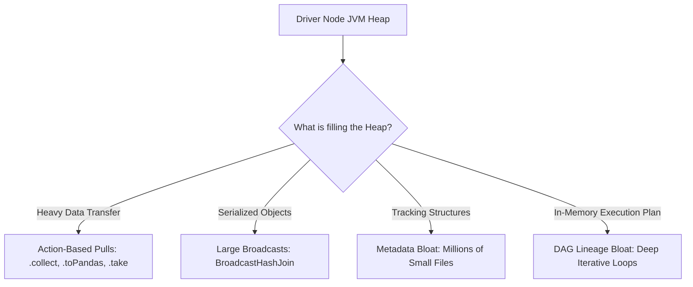

# 4.1.5 You get an OOM error on the Driver node. What could be the cause?

# 1. Causes of Driver Out of Memory (OOM) Errors

## Data Accumulation via Actions (.collect and .toPandas)

The driver is designed to orchestrate work, not process raw data. Pulling processed data back to the driver is the most common cause of driver OOM errors.

*   **Calling `.collect()` or `.toPandas()`**: 
    *   *The Mechanism*: These commands retrieve every partition of a distributed dataset from the executors and merge them into a single, contiguous array in the driver JVM heap.
    *   *The Result*: If the uncompressed size of the merged dataset exceeds `spark.driver.memory`, the driver crashes.
*   **Calling `.take(N)` or `.first()` on unsorted datasets**:
    *   *The Mechanism*: While `take(N)` is safer than `collect()`, if `N` is excessively high or the individual rows are massive binary blobs, the driver heap is quickly exhausted.
*   **Mitigation**:
    *   Always write the results directly to persistent storage (e.g., S3, ADLS, HDFS) via `.write.parquet()` instead of collecting.
    *   If you must inspect the data, use aggregation functions (`.count()`, `.describe()`) on the executors first to reduce the footprint.

> [!WARNING]
> Spark does not perform pagination or memory checks during a `.collect()` call. It will attempt to load the entire dataset into the driver heap even if it is 100x larger than the available RAM, leading to an immediate crash.

## Broadcast Joins Exceeding Thresholds

When performing joins, Spark can broadcast a smaller table to all executors to bypass a costly shuffle step. However, this optimization heavily leverages the driver node.

*   **The Broadcast Workflow**: 
    *   The driver collects the partition data of the broadcast table into its own memory space.
    *   It builds a local hash table from the data.
    *   It serializes and pushes this hash table to all executors.
*   **The Cause of OOM**:
    *   If the broadcast table is larger than the driver’s free heap space, the driver fails during the collection or hash table build phase.
    *   This occurs when `spark.sql.autoBroadcastJoinThreshold` is set too high, or when developers manually wrap a large DataFrame in the `broadcast()` function.
*   **Mitigation**:
    *   Ensure `spark.sql.autoBroadcastJoinThreshold` is kept at a conservative value (the default is 10MB).
    *   Only use manual broadcast joins on tables that you are absolutely certain are small enough to fit within your driver memory margin.

## Metadata Explosion and Plan Lineage Complexity

The driver must track the structural schema, execution plan, and file statistics for your Spark application. When a workload becomes highly complex, this metadata footprint can saturate the heap.

*   **The Small Files Problem (Metadata Bloat)**:
    *   *The Mechanism*: If you are reading from directories containing millions of tiny files, the driver has to hold the file paths, schemas, compression statistics, and block locations in memory to plan the tasks.
    *   *The Result*: The planning phase alone consumes the entire driver heap before a single executor task is even scheduled.
*   **DAG Lineage Bloat**:
    *   *The Mechanism*: When you write highly iterative pipelines (e.g., deep loops, complex machine learning algorithms, or hundreds of sequential `.union()` or `.join()` calls), the Spark driver builds an increasingly large, un-evaluated execution lineage graph.
    *   *The Result*: The memory required to store and optimize the physical execution plan grows exponentially, eventually triggering a stack overflow or heap OOM in the driver during plan parsing.
*   **High Task Tracking Count**:
    *   *The Mechanism*: If your job is split into hundreds of thousands of individual tasks, the driver must maintain the state, scheduling metadata, and execution metrics of every single task in memory.
*   **Mitigation**:
    *   **Compact Inputs**: Merge small upstream files into larger blocks (128MB–512MB) before reading them.
    *   **Break Lineage**: Use `.localCheckpoint()` or write intermediate results to disk and reload them to truncate a massive DAG lineage.
    *   **Tune Partitions**: Consolidate overly fragmented partitions to keep the task count per stage under control.

> [!NOTE]
> Unlike executors, driver memory cannot utilize spilling. If any of the tracking or planning phases exceed the driver JVM limits, the JVM has no choice but to exit with an `OutOfMemoryError`.
