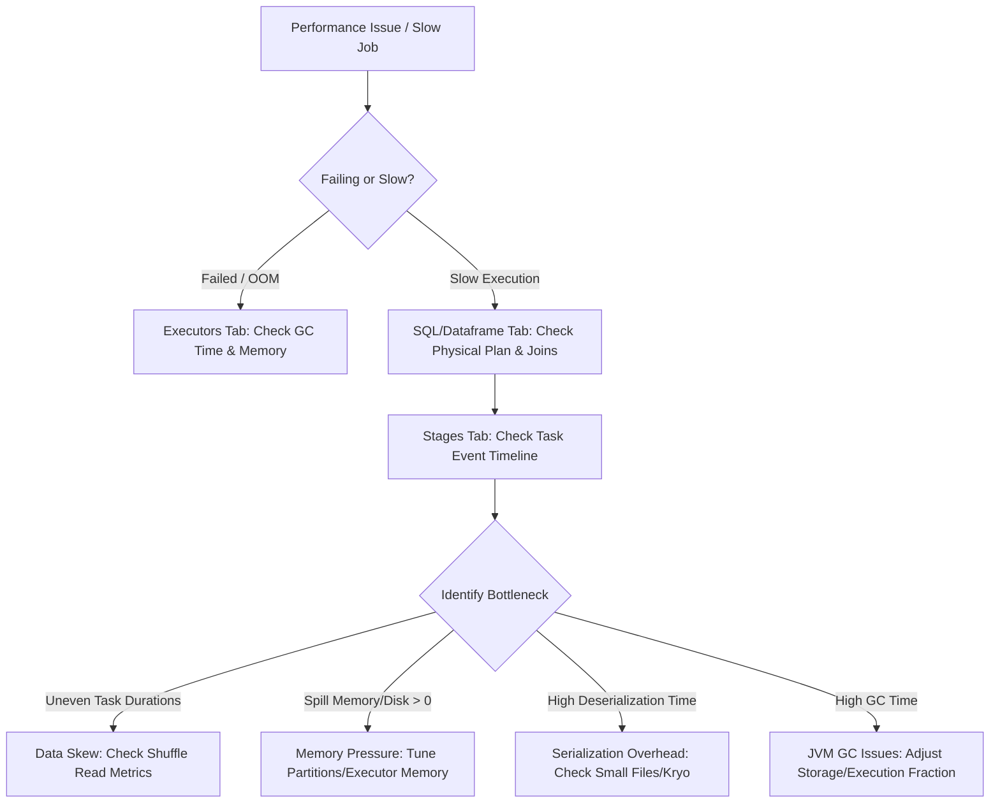

# 4.2.1 What are the most important tabs in the Spark UI for performance debugging?



### 1. The SQL / DataFrame Tab (The Structural Entrypoint)
Before looking at tasks, start here to understand **what** Spark is actually executing. It maps your high-level code to physical execution metrics.

*   **What to Look For**:
    *   **The Directed Acyclic Graph (DAG)**: Look for nodes that scan massive amounts of data or generate huge shuffles.
    *   **Adaptive Query Execution (AQE)**: Check if AQE optimized the plan (e.g., *AdaptiveSparkPlan* node), changed joins, or coalesced shuffle partitions.
    *   **Physical Operators**: Look for `SortMergeJoin` (slow, requires shuffle) vs. `BroadcastHashJoin` (fast, no shuffle).
    *   **Filter Pushdowns**: Check the scanning node (e.g., `FileSourceScan`) to ensure `PushedFilters` contains your partition filters. If not, Spark is scanning the entire dataset.
*   **Debugging Actions**:
    *   If you see `SortMergeJoin` on a small table, increase `spark.sql.autoBroadcastJoinThreshold`.
    *   If you see no partition pruning, rewrite your query to filter on partition columns earlier.

> [!TIP]
> **Pro-Tip**: Click on the final node of the SQL tab DAG. It displays total execution time, total rows output, and the exact physical plan details that executed.

### 2. The Stages Tab (The Deep Diagnostic Engine)
This is where 90% of performance bottleneck identification happens. Drill down into specific slow stages and analyze the **Task Metrics Table** (specifically the min, 25th, median, 75th, and max percentiles).

```
Metric                 Min     25th    Median  75th    Max
------------------------------------------------------------
Duration               2s      2s      3s      45m     52m    <-- Severe Data Skew!
Shuffle Read Size      10KB    12KB    15KB    1.2GB   1.5GB  <-- Skew Confirmed
```

*   **What to Look For**:
    *   **Data Skew Indicator**: Compare the **75th percentile** and **Max** values for *Duration* and *Shuffle Read Size*. If the Max is orders of magnitude larger than the Median, you have **Data Skew** (one partition has way too much data, holding up the entire stage).
    *   **Spill (Memory) & Spill (Disk)**: If these values are greater than 0, your executor ran out of execution memory while sorting or aggregating. It had to write temporary data to disk, causing massive disk I/O overhead.
    *   **Task Deserialization Time**: If this is high relative to *Executor Computing Time*, you have too many small tasks/partitions, or your serialization format is slow.
    *   **Event Timeline**: Click to expand this visualization. 
        *   If the timeline is mostly **Green (Compute)**: Code is efficient.
        *   If it is mostly **Orange (Shuffle Write)** or **Purple (Shuffle Read)**: Network/I/O bottleneck.
        *   If it is mostly **Red (GC Time)**: The JVM is spending all its time cleaning up garbage, not executing code.

> [!WARNING]
> **The Spill Trap**: If `Spill (Disk)` is high, do not simply increase executor memory. Try increasing `spark.sql.shuffle.partitions` to break the data into smaller, more manageable chunks that fit within the execution memory fraction.

### 3. The Executors Tab (Resource & JVM Health)
This tab provides a hardware-level view of your cluster's resource utilization. It helps identify if the cluster is sized correctly or if your JVM is misconfigured.

*   **What to Look For**:
    *   **GC Time / Task Time Ratio**: If GC (Garbage Collection) time is more than **10%** of the total task time, you have JVM memory pressure.
    *   **Task Distribution**: Check the *Completed Tasks* column across all executors. If executor 1 has completed 10,000 tasks and executor 2 has completed 50 tasks, your cluster is severely unbalanced (likely due to custom partitioners or skew).
    *   **Storage Memory vs. Execution Memory**: Check if your cached RDDs/DataFrames are squeezing out the memory needed for shuffles and joins.
*   **Debugging Actions**:
    *   High GC time? Adjust `spark.memory.fraction` or switch to the G1GC garbage collector via `spark.executor.extraJavaOptions=-XX:+UseG1GC`.
    *   Unbalanced executor tasks? Repartition your input data using a high-cardinality key before performing heavy transformations.

> [!NOTE]
> **Dead Executors**: If you see executors marked as *Dead* or *Killed*, check the stderr/YARN logs for `OOM (Out of Memory) / Command exited with code 137`. This usually means the executor requested more memory from the yarn/k8s node manager than allowed (often due to overhead memory issues).

### 4. The Storage Tab (Cache & Persistence Tracker)
This tab displays all cached datasets (`.cache()` or `.persist()`).

*   **What to Look For**:
    *   **Fraction Cached**: Ensure this value is **100%**. If it is less (e.g., 60%), Spark is evicting partitions of your cached data to make room for execution memory. Every time you query this dataset, Spark has to recompute the missing 40% on the fly.
    *   **Storage Level**: Confirm whether the data is stored in `Memory Only`, `Memory and Disk`, or serialized (`Serialized 1x`).
*   **Debugging Actions**:
    *   If Fraction Cached is < 100%, either increase executor memory, use `MEMORY_AND_DISK_SER` (to serialize data and save memory footprint), or unpersist (`.unpersist()`) datasets that are no longer needed.

### 5. Quick Diagnostic Cheat Sheet

| Symptom | Primary Tab to Check | Key Metric to Inspect | Fix Action |
| :--- | :--- | :--- | :--- |
| **Stage hanging at 99%** | **Stages** | Max Task Duration >> Median Task Duration; Max Shuffle Read >> Median | Mitigate Skew (Salt join keys, enable AQE skew join) |
| **Executor Out of Memory (OOM)** | **Executors** | JVM GC Time > 10%; Dead/Killed status | Increase `spark.executor.memory`, tune partition size, or adjust GC options |
| **Disk I/O Bottlenecks** | **Stages** | `Spill (Memory)` and `Spill (Disk)` > 0 | Increase partition count (`spark.sql.shuffle.partitions`) to reduce partition size |
| **Extremely slow start times** | **Stages / SQL** | Task Deserialization Time is high | Consolidate input files (avoid small file problem); use Kryo Serializer |
