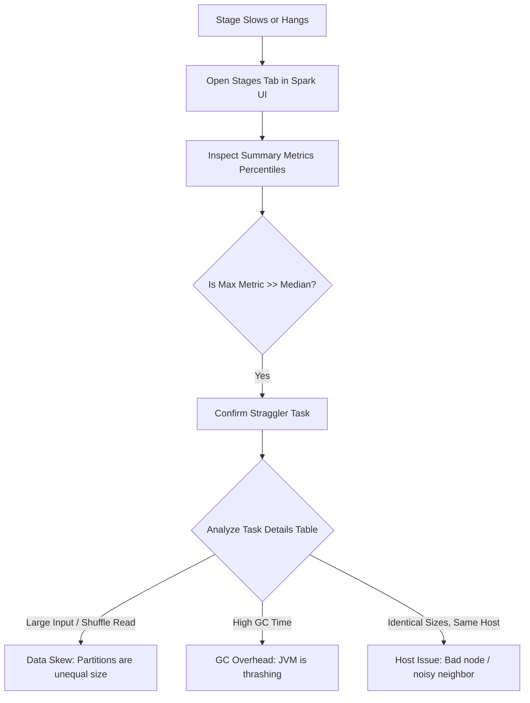

# 4.2.2 How do you identify a straggler task in the Spark UI?

## 1. Spotting Stragglers in the Stages Tab

A straggler is a task that takes significantly longer to complete than other tasks in the same stage, blocking execution progress. The **Stages** tab is the primary interface used to isolate them.

### Summary Metrics Table
Navigate to the active or slow stage and inspect the **Summary Metrics for Completed Tasks** table. This table shows percentiles (Min, 25th, Median, 75th, 95th, Max) for various task metrics.

*   **Duration**: Look at the *Median* versus the *Max*. If the median task duration is *10 seconds* but the max duration is *45 minutes*, you have a classic straggler task.
*   **Input Size / Records**: If the max input size is substantially larger than the median, the straggler is caused by **upstream data partitioning issues**.
*   **Shuffle Read Size**: If the max shuffle read size is massive compared to the median, the straggler is caused by **data skew during a shuffle operation** (e.g., joins or aggregations on low-cardinality keys).

### Task Event Timeline
Expand the **Event Timeline** visualization at the top of the Stage details page. 

*   A healthy stage shows a dense block of short, evenly sized bars across all executors.
*   A stage with stragglers shows a few **long, isolated horizontal bars** stretching far to the right while other executors sit idle (shown as empty space).
*   The colors within the bar represent where the time is being spent:
    *   **Blue (Scheduler Delay)**: Spark driver overhead.
    *   **Red (GC Time)**: Executor is pausing to clean memory.
    *   **Orange (Shuffle Write Time)**: Disk/network bottleneck writing partition data.
    *   **Green (Executor Computing Time)**: CPU bound computation.

## 2. Root Cause Analysis (Why is it a Straggler?)

Once the straggler task is identified, scroll down to the **Tasks** table at the bottom of the page. Sort the table by **Duration** (descending) to bring the straggler tasks to the top, and evaluate their metrics.

### Case A: Data Skew
*   **Spark UI Indicators**: The straggler task shows a high **Input Size** or **Shuffle Read Size** compared to other tasks, while **Executor Computing Time** is also high.
*   **Root Cause**: Your data clustering key has unevenly distributed values (e.g., sorting or joining on a column with many `NULL` or default values).
*   **Actionable Fix**: 
    *   Filter out `NULL` values before performing joins/aggregations if they are not needed.
    *   Enable **Adaptive Query Execution (AQE)** skew join handling via `spark.sql.adaptive.skewJoin.enabled = true`.
    *   Apply **salting** to the join key to manually distribute the skewed keys across multiple partitions.

### Case B: Bad Executor or Noisy Neighbor
*   **Spark UI Indicators**: The straggler task has **normal/average Input and Shuffle Read Sizes**, but its **Duration** is exceptionally high. Additionally, check the **Host** column; if multiple slow tasks are executing on the same machine/host, the node itself is compromised.
*   **Root Cause**: The physical machine hosting the executor has hardware degradation, CPU throttling, or resource contention from other containers running on the same host.
*   **Actionable Fix**: 
    *   Enable **Speculative Execution** via `spark.speculation = true`. Spark will launch a duplicate copy of the slow task on a different executor and use the result of whichever finishes first.

### Case C: JVM Garbage Collection (GC) Pressure
*   **Spark UI Indicators**: The **GC Time** column for the straggler task is highly elevated (often accounting for >10% of total task duration). 
*   **Root Cause**: The executor JVM is running out of memory heap space, causing frequent, long-running stop-the-world garbage collection pauses.
*   **Actionable Fix**:
    *   Increase executor memory using `spark.executor.memory`.
    *   Decrease the space allocated to storage to free up execution memory by reducing `spark.memory.storageFraction`.
    *   Use the G1GC garbage collector by setting `spark.executor.extraJavaOptions=-XX:+UseG1GC`.

### Case D: Serialization & Small File Overhead
*   **Spark UI Indicators**: The task **Task Deserialization Time** or **Result Serialization Time** is high relative to the compute time.
*   **Root Cause**: The job is reading thousands of tiny files (each creating a separate task), or the objects being passed across the network are excessively large.
*   **Actionable Fix**:
    *   Coalesce or compact input files before processing.
    *   Switch serialization from Java serializer to Kryo Serializer via `spark.serializer=org.apache.spark.serializer.KryoSerializer`.

> [!NOTE]
> When debugging, always check the **Task ID** and **Attempt** columns. If a task has an attempt number greater than 0 (e.g., `Task 42.1`), Spark has already retried or speculated that task due to failure or slowness.
