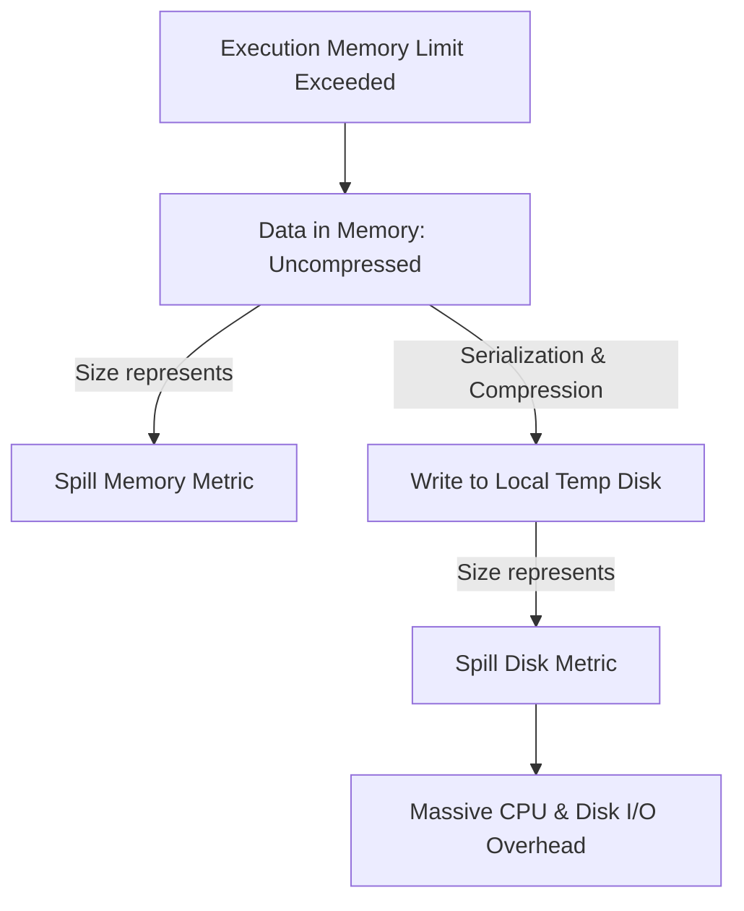

# 4.2.3 What does Spill (Memory) and Spill (Disk) mean in the Spark UI?

# 1. Spill (Memory) vs. Spill (Disk) in Spark

## Key Definitions and Performance Impact

When Spark executes operations like sorting, joining, or aggregating, it requires a chunk of RAM called **Execution Memory**. If the data within a partition exceeds this limit, Spark avoids crashing with an Out Of Memory (OOM) error by "spilling" the excess data to the local disk of the executor.

*   **Spill (Memory)**: The size of the data in memory *before* it is written to disk. This represents the uncompressed, deserialized Java object size of the data structures being processed.
*   **Spill (Disk)**: The actual size of the data written to the local disk. This represents the compressed, serialized version of the spilled data.
*   **Performance Impact**: Spilling is a performance killer. It introduces heavy CPU overhead for serialization/deserialization and massive I/O overhead from writing to and reading from local disk storage.

> [!WARNING]
> While spilling prevents OOM errors, it can slow down your job by 2x to 10x. If you see high spill metrics, your job is bottlenecked by disk write/read speeds and CPU serialization overhead.

## Why Spill (Memory) is Larger than Spill (Disk)

In almost all cases, **Spill (Memory) is significantly larger than Spill (Disk)**. This is normal and expected behavior due to how data is transformed during the spill process.

*   **In-Memory Representation**: In RAM, Spark data is represented as Java objects, which include heavy object headers, pointers, and memory alignment padding. This structure makes the data highly bloated in memory.
*   **On-Disk Representation**: When spilling to disk, Spark serializes these Java objects into a compact byte stream and applies compression algorithms (such as LZ4, Snappy, or Zstd depending on your configuration).
*   **Discrepancy Scale**: Spill (Memory) is typically **2x to 5x larger** than Spill (Disk) because of this compression and serialization efficiency.

> [!NOTE]
> If your Spark UI shows *Spill (Memory) = 10 GB* and *Spill (Disk) = 2 GB*, you have moved 10 GB of active JVM object space into 2 GB of compressed files on disk. 

## How to Diagnose and Eliminate Spills

Spilling indicates that individual task partitions are too large to fit into the allocated execution memory of the executor.

### Step 1: Tune Partitions
*   **Action**: Increase `spark.sql.shuffle.partitions` (the default is 200). 
*   **Why**: This splits your data into a larger number of smaller partitions. If each partition fits entirely within the executor's memory segment, no spilling occurs.
*   **Rule of Thumb**: Target a post-shuffle partition size of **100 MB to 200 MB**.

### Step 2: Adjust Memory Configurations
*   **Action**: Increase the total executor memory or adjust the execution memory fraction.
*   **Parameters**:
    *   Increase `spark.executor.memory`.
    *   Increase `spark.memory.fraction` (controls the overall space for execution and storage).
    *   Decrease `spark.memory.storageFraction` (forces Spark to prioritize execution memory over cached/storage memory).

### Step 3: Mitigate Data Skew
*   **Action**: If only a few tasks are spilling (check the Stages tab), you have a data skew issue.
*   **Why**: A skewed key causes a single task to receive a massive partition of data, forcing that specific task to spill, even if the overall cluster has plenty of memory.
*   **Fix**: Enable Adaptive Query Execution skew join handling (`spark.sql.adaptive.skewJoin.enabled = true`) or salt your join keys.
