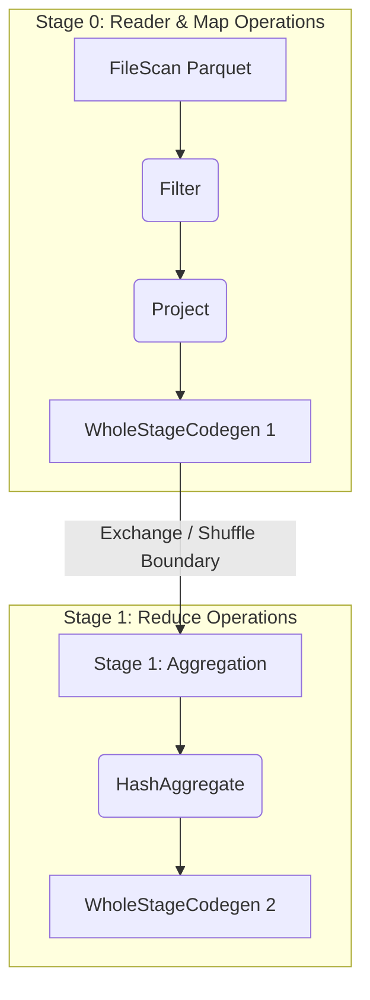

# 4.2.4 How do you read a DAG (Directed Acyclic Graph) visualization?

# 1. Decoding Spark UI DAG Visualizations

## Structural Elements and Visual Indicators

A Directed Acyclic Graph (DAG) in Spark represents the sequential execution plan of a job. It flows from top to bottom (or left to right), where vertices represent RDDs/DataFrames, and edges represent operations (transformations) applied to them.

*   **Blue Shaded Containers (Whole-Stage Codegen)**: These dashed or solid outline boxes represent a physical query optimization phase. Spark's Tungsten engine collapses multiple physical operators (like *Filter*, *Project*, and *Local HashAggregate*) into a single, highly optimized Java function. This eliminates virtual function calls and keeps intermediate data in CPU registers.
*   **The Exchange Node**: This node represents a **Shuffle Boundary**. Whenever data must be repartitioned or moved across the network (e.g., during a `join()`, `groupBy()`, or `repartition()`), an *Exchange* node is generated. 
*   **Stage Boundaries**: An *Exchange* node splits the DAG. Everything upstream of the *Exchange* runs in one Stage, and everything downstream runs in a separate, subsequent Stage. Stages are isolated and run sequentially if they have a hard data dependency.

> [!NOTE]
> Pipelines inside a single **Whole-Stage Codegen** box do not write data to disk or send it over the network. They pipeline records in-memory across the CPU. Performance drops occur primarily when crossing the boundary of these boxes into an *Exchange* node.

## Critical DAG Operators to Inspect

When debugging a slow query plan, specific nodes in the DAG visualization contain metadata that indicates optimization success or failure.

*   **FileScan / BatchScan**: This is the leaf node representing the data source read operation. Click this node to inspect:
    *   *PushedFilters*: Verify if partition pruning or column projection was pushed down to the storage level (e.g., Parquet metadata filters).
    *   *ReadSchema*: Ensure Spark is only reading the columns required for the query, rather than scanning the entire schema.
*   **HashAggregate**: This indicates an aggregation operation (e.g., `count`, `sum`). Spark typically performs this in two steps to reduce shuffle size:
    *   *Local HashAggregate*: Occurs before the shuffle boundary to aggregate data within individual partitions.
    *   *Global/Merge HashAggregate*: Occurs after the shuffle boundary to merge the local aggregates into final results.
*   **BroadcastExchange / BroadcastHashJoin**: Indicates a map-side join. One dataset is small enough to be broadcasted to all executors, bypassing a heavy shuffle. This is the most efficient join type in Spark.
*   **SortMergeJoin**: Indicates a join that requires shuffling and sorting both datasets on the join key. Look for an *Exchange* and a *Sort* node directly preceding this operator.

> [!TIP]
> If you see `SortMergeJoin` in your DAG for a join involving a small lookup table, check why `spark.sql.autoBroadcastJoinThreshold` was not triggered. Forcing a broadcast join can eliminate the costly preceding *Exchange* and *Sort* steps.

## Identifying Performance Bottlenecks via the DAG

Analyzing the structure of the DAG helps isolate structural flaws in code or configurations before diving into executor logs.

*   **Too Many Stages (The Shuffle Waterfall)**: If the DAG has a long vertical chain of *Exchange* nodes, the query is performing repetitive shuffles. This happens when multiple wide transformations are applied sequentially without reusing partitioned data.
    *   *Mitigation*: Use `.repartition(col)` or `.bucketBy()` on the write side to partition data on the join/aggregation key once, or cache a reusable intermediate DataFrame.
*   **The Cartesian Product (Nested Loop Join)**: If you see a `CartesianProduct` node in the DAG, it means Spark is performing an $O(N \times M)$ cross join.
    *   *Mitigation*: Check join conditions. A missing or incorrect join key will fall back to this highly inefficient join strategy.
*   **Skipped Stages**: In the DAG, some stages may be shaded grey and marked as *Skipped*. This is healthy; it means Spark is utilizing cached data (from `.cache()`) or Adaptive Query Execution (AQE) has determined that a partition does not need to be read.

> [!WARNING]
> Keep an eye out for **Multiple File Scans of the same source**. If the DAG shows identical `FileScan` operators reading from the same path multiple times, you are scanning raw data repeatedly. Cache the source DataFrame after the initial read to avoid repeated disk I/O.
