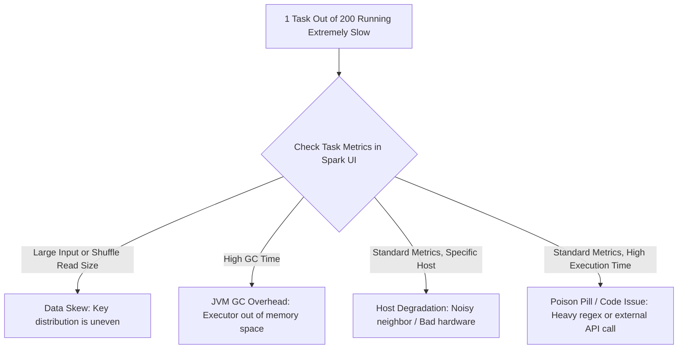

# 4.2.5 If a stage has 200 tasks and 1 task takes 10x longer than the rest, what is the likely issue?

# 1. Diagnosing a Single Straggler Task out of 200

## Primary Root Cause: Data Skew

The default value for `spark.sql.shuffle.partitions` is **200**. If a stage has exactly 200 tasks and only 1 is taking 10x longer, the most likely issue is **Data Skew**.

*   **How it Occurs**: During a wide transformation (such as a `join` or `groupBy`), Spark hashes the partition keys to distribute records across the 200 shuffle partitions. If a single key is disproportionately present (e.g., millions of `NULL` values, empty strings, or a default ID like `-1`), all records with that key are routed to the **same single task**.
*   **Verification in Spark UI**:
    *   Navigate to the **Stages** tab and open the slow stage.
    *   Compare the **Max** percentile to the **Median** and **75th** percentiles for *Shuffle Read Size* and *Records*.
    *   If the Median Shuffle Read is *50 KB* but the Max is *2 GB*, data skew is confirmed.

> [!IMPORTANT]
> Because Spark stages only complete when their *slowest* task completes, a single skewed partition will hold the entire application hostage while the other 199 executors sit idle.

## Secondary Root Causes: Hardware, GC, and Code Anomalies

If the *Shuffle Read Size* and *Records* metrics are perfectly balanced across all 200 tasks, the bottleneck is operational or code-related rather than data-related.

*   **JVM Garbage Collection (GC) Overhead**: 
    *   *Indicator*: High **GC Time** on the slow task's row in the Task table.
    *   *Cause*: The executor handling this task is thrashing, spending more time running GC cycles than executing CPU operations.
*   **Bad Executor Node (Noisy Neighbor)**:
    *   *Indicator*: The task metrics (size, records, GC) look completely normal, but execution is extremely slow. 
    *   *Cause*: The task is assigned to an executor running on a degraded physical host, facing CPU throttling or severe disk/network contention from other containers.
*   **Poison Pill (Data-Driven Code Bottleneck)**:
    *   *Indicator*: Extremely high *Executor Computing Time* with normal data sizes.
    *   *Cause*: A single malformed record inside that specific partition triggers an expensive code path, such as an inefficient regular expression, an infinite loop inside a User Defined Function (UDF), or a timeout on an external API or database call.

> [!WARNING]
> Do not jump straight to changing cluster sizing. Sizing up executors will not resolve a structural data skew or a poison pill.

## Step-by-Step Resolution Playbook

Apply these targeted fixes depending on the confirmed root cause from your Spark UI analysis.

### Solution for Data Skew
*   **Enable Adaptive Query Execution (AQE)**: Set `spark.sql.adaptive.skewJoin.enabled = true`. AQE detects skewed partitions at runtime and splits them into smaller sub-partitions, converting a single giant task into multiple parallel tasks.
*   **Pre-Filter Skewed Keys**: If the skew is caused by dummy keys or placeholder values (like `null` or `-1`), filter them out prior to the join or aggregation if they are not needed.
*   **Salting the Keys**: Manually append a random integer (a "salt") to the join key on the skewed table, and replicate the rows on the lookup table to distribute the hot key across multiple partitions.

### Solution for Bad Nodes
*   **Enable Speculative Execution**: Set `spark.speculation = true`. If a task is running significantly slower than the median task duration for that stage, Spark will launch a duplicate attempt of the same task on a different executor. Whichever attempt finishes first is kept, and the slow one is killed.

### Solution for GC & Code Issues
*   **Review Custom UDFs**: Replace non-performant Python or Scala UDFs with built-in Spark SQL functions, which run optimized Java bytecode inside the Tungsten engine.
*   **Switch Garbage Collector**: Configure your JVM options to use G1GC via `spark.executor.extraJavaOptions=-XX:+UseG1GC` to handle large heaps with minimal pause times.
