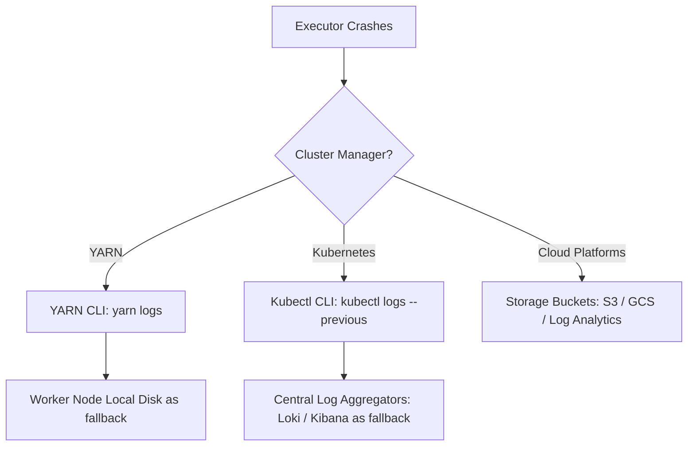

# 4.2.6 Where do you find the application logs for a crashed executor?

# 1. Finding Logs for a Crashed Spark Executor

When an executor process crashes, the active Spark UI links to `stdout` and `stderr` for that executor will break because the background HTTP server on the dead executor node is no longer accessible. Accessing the logs requires checking the underlying cluster resource manager or centralized log stores.

## Finding Logs in a YARN Environment

In an on-premise or managed Hadoop/YARN cluster (such as AWS EMR in YARN mode or Cloudera), executors run inside YARN containers.

*   **Via YARN Command Line Interface (CLI)**: 
    *   If log aggregation is enabled (`yarn.log-aggregation-enable=true`), YARN aggregates all container logs into HDFS.
    *   Run the command to fetch logs for the specific dead container: 
        `yarn logs -applicationId <application_id> -containerId <container_id>`
    *   To get logs for the entire application, run:
        `yarn logs -applicationId <application_id>`
*   **Via YARN ResourceManager Web UI**:
    *   Navigate to the YARN RM Web UI (usually port 8088).
    *   Locate the specific Application ID.
    *   Click on **Attempts** -> **Containers** -> Select the failed container ID to view the aggregated stdout/stderr logs.
*   **Via Worker Node Local Storage (Before Aggregation)**:
    *   If the application is still running and log aggregation has not occurred yet, log files are stored on the local disk of the worker node where the executor ran.
    *   SSH into the specific worker node and find the local directory mapped under `yarn.nodemanager.log-dirs`:
        `/var/log/hadoop-yarn/containers/application_<app_id>/container_<container_id>/`
    *   Inspect `stderr` to find JVM crashes, segmentation faults, or OOM (Out Of Memory) dumps.

> [!IMPORTANT]
> A common exit code found in YARN container logs for crashed executors is **Exit Code 137**. This means the YARN NodeManager killed the executor container because it exceeded its physical memory limit (YARN overhead memory limit + JVM memory).

## Finding Logs in a Kubernetes Environment

In a Kubernetes (K8s) environment, executors run inside individual Pods.

*   **Via kubectl for Evicted/Crashed Pods**:
    *   If the Pod still exists in a `Failed` or `Error` state, you can read the logs of the crashed container by using the `--previous` flag:
        `kubectl logs <executor-pod-name> -n <namespace> --previous`
*   **If the Pod Has Been Deleted**:
    *   By default, Spark on K8s cleans up deleted executor pods (`spark.kubernetes.executor.deleteOnTermination=true`). When deleted, standard K8s API logs are gone.
    *   You must query your centralized logging service (e.g., Elasticsearch/Kibana, Grafana Loki, or Splunk) where container stdout/stderr was streamed dynamically.
*   **Via Kubernetes Events**:
    *   If the logs are completely lost, check the cluster events to find out *why* the pod terminated:
        `kubectl describe pod <executor-pod-name> -n <namespace>`
    *   Look at the **Last State** or **Events** section. If the Reason shows **OOMKilled**, the host kernel killed the Spark executor for violating container memory limits.

> [!WARNING]
> If you have not configured a persistent centralized logging solution (like Loki, CloudWatch, or FluentD to S3/GCS) in your Kubernetes cluster, you will not be able to retrieve logs for deleted executor pods once they are terminated and cleared from K8s memory.

## Finding Logs in Cloud-Managed Platforms (AWS EMR / Databricks)

Cloud providers isolate application logs from transient cluster runtimes by pushing them directly to persistent cloud storage buckets.

*   **AWS EMR (S3 Storage)**:
    *   EMR automatically pushes logs to S3 if configured during cluster creation.
    *   Navigate to your configured S3 log URI:
        `s3://<your-emr-log-bucket>/containers/application_<app-id>/container_<container-id>/`
    *   Here you will find `stderr.gz` and `stdout.gz` files containing the logs of the terminated executor.
*   **Databricks (DBFS Storage)**:
    *   If Cluster Log Delivery is enabled in the Databricks Cluster settings, driver and executor logs are delivered periodically to a DBFS or S3/ADLS path.
    *   Navigate to the path:
        `dbfs:/cluster-logs/<cluster-id>/executor/<executor-id>/`
    *   Alternatively, open the **Compute** section in Databricks, select your cluster, click the **Driver Logs** or **Spark UI** tab, and download the active log archives.

> [!TIP]
> If an executor crashes due to a silent JVM termination (e.g., Segfault, C++ native code error inside a JNI call, or host spot-instance termination), the executor will not have time to log the failure to its own `stderr`. In this situation, look at the **Driver Logs** because the driver is the coordinator and will log the explicit heart-beat loss event or JVM exit code reported by the resource manager.
